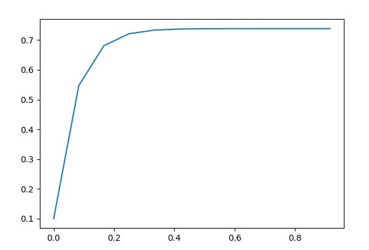
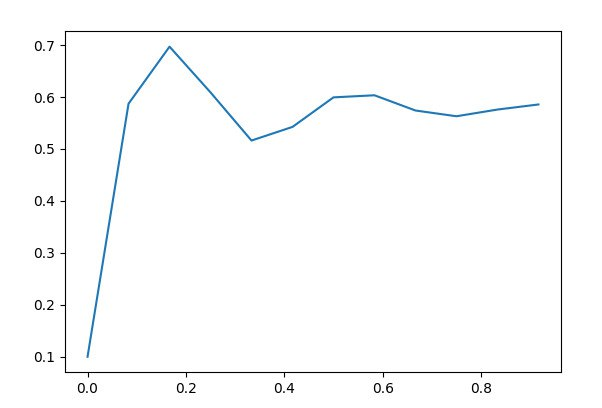

Министерство образования Республики Беларусь

Учреждение образования

“Брестский Государственный технический университет”

Кафедра ИИТ

Лабораторная работа №1

По дисциплине “Общая теория интеллектуальных систем”

Тема: “Моделирования температуры объекта”

Выполнил:

Студент 2 курса

Группы ИИ-21

Парфеевец И.А.

Проверил:

Иванюк Д. С.

Брест 2022

---

# Общее задание #
1. Написать отчет по выполненной лабораторной работе №1 в .md формате (readme.md) и с помощью запроса на внесение изменений (**pull request**) разместить его в следующем каталоге: trunk\ii0xxyy\task_01\doc (где xx - номер группы, yy - номер студента, например **ii02102**).
2. Исходный код написанной программы разместить в каталоге: **trunk\ii0xxyy\task_01\src**.

## Task 1. Modeling controlled object ##
Let's get some object to be controlled. We want to control its temperature, which can be described by this differential equation:

$$\Large\frac{dy(\tau)}{d\tau}=\frac{u(\tau)}{C}+\frac{Y_0-y(\tau)}{RC} $$ (1)

where $\tau$ – time; $y(\tau)$ – input temperature; $u(\tau)$ – input warm; $Y_0$ – room temperature; $C,RC$ – some constants.

After transformation we get these linear (2) and nonlinear (3) models:

$$\Large y_{\tau+1}=ay_{\tau}+bu_{\tau}$$ (2)
$$\Large y_{\tau+1}=ay_{\tau}-by_{\tau-1}^2+cu_{\tau}+d\sin(u_{\tau-1})$$ (3)

where $\tau$ – time discrete moments ($1,2,3{\dots}n$); $a,b,c,d$ – some constants.

Task is to write program (**Julia**), which simulates this object temperature.

---

# Выполнение задания #

Код программы:

    a = 0.3
    b = 0.47
    c = 0.13
    d = 0.47
    u = 1.1
    y = 0.1
    
    println("linear model")
    function linearmod(t,n,y)
        if n < t
            println(y)
            return linear(a * y + b * u, n+1, t)
        end
        println(y)
        return a * y + b * u
    end
    println(linearmod(10, 0, y))
    
    println("******************")
    
    println("unlinear model")
    function unlinearmodel(y, y_prev, u, u_prev, i, t)
        if i == 1
            println(y)
            return nonlinearmodel(a*y - b*y_prev^2 + c*1 + d*sin(1), y, u, u, i + 1, t)
        elseif i < t
            println(y)
            return nonlinear_model(a*y - b*y_prev^2 + c*u + d*sin(u_prev), y, u, u, i + 1, t)
        end
        println(y)
        return a*y - b*y_prev^2 + c*u + d*sin(u_prev)
    end

    Вывод:
    Линейная модель
    0.1
    0.547
    0.6811
    0.72133
    0.733399
    0.7370197
    0.73810591
    0.7384317730000001
    0.7385295319
    0.73855885957
    0.738567657871
    0.7385702973613
    *********************
    Нелинейная модель
    0.1
    0.5871674592288747
    0.6969416006283737
    0.6089100955840594
    0.5162485184014658
    0.5424794076323459
    0.5993503911252754
    0.6033591399450411
    0.5740413822816373
    0.5629800155884126
    0.5758854148766465
    0.5856682296544619

    Графики:

    Линейный
    
    
    Нелинейный
