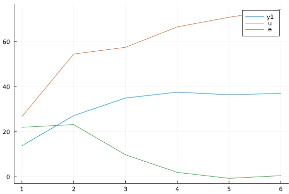

<p align="center"> Министерство образования Республики Беларусь</p>
<p align="center">Учреждение образования</p>
<p align="center">“Брестский Государственный технический университет”</p>
<p align="center">Кафедра ИИТ</p>
<br><br><br><br><br><br><br>
<p align="center">Лабораторная работа №2</p>
<p align="center">По дисциплине “Общая теория интеллектуальных систем”</p>
<p align="center">Тема: “ПИД-регуляторы”</p>
<br><br><br><br><br>
<p align="right">Выполнил:</p>
<p align="right">Студент 2 курса</p>
<p align="right">Группы ИИ-21</p>
<p align="right">Парфеевец И. А.</p>
<p align="right">Проверил:</p>
<p align="right">Иванюк Д. С.</p>
<br><br><br><br><br>
<p align="center">Брест 2022</p>

---

# Общее задание #
1. Написать отчет по выполненной лабораторной работе №1 в .md формате (readme.md) и с помощью запроса на внесение изменений (**pull request**) разместить его в следующем каталоге: **trunk\ii0xxyy\task_02\doc** (где **xx** - номер группы, **yy** - номер студента, например **ii02102**).
2. Исходный код написанной программы разместить в каталоге: **trunk\ii0xxyy\task_02\src**.

# Задание #
На Julia реализовать программу, моделирующую рассмотренный выше ПИД-регулятор.  В качестве объекта управления использовать математическую модель, полученную в предыдущей работе.
В отчете также привести графики для разных заданий температуры объекта, пояснить полученные результаты.

---
# Код программы: #
```julia    
A = 0.5; B = 0.5; C = 0.5; D = 0.5;
K = 1; T₀ = 1; Tᴰ = 1; T = 1;

q₁ =  K * (Tᴰ / T₀ + 1)  ;
q₂ = -K * (-T₀ / T + 1 + 2 * Tᴰ / T₀);
q₃ =  K * (Tᴰ / T₀);

print("Enter start temperature: ");
start_y = parse(Float64, readline());
y = [start_y, start_y];

uᵏ = 0.0; uᵏ⁻¹ = 0.0;

print("Enter desired temperature: ");
w = parse(Float64, readline());

e = [w - start_y, w - start_y]	;

println(y[end]);
while abs(w - y[end]) > 0.1
	push!(e, w - y[end]);

	Δu = q₁ * e[end] + q₂ * e[end - 1] + q₃ * e[end - 2];
	global uᵏ = uᵏ⁻¹ + Δu;

	push!(y, A * y[end] - B * y[end - 1] + C * uᵏ + D * sin(uᵏ⁻¹));
	global uᵏ⁻¹ = uᵏ;

	println(y[end]);
end
```

Вывод:
```
Enter start temperature: 0
Enter desired temperature: 580
0.0
290.0
435.46504190248857
507.7325209512443
543.8578552569427
561.5713653942684
570.6011249827219
574.9572769655811
577.4201890654178
579.6962583227144
579.2624332464873
579.8734462137627
579.4898846034246
580.1822523562806
579.4776369956747
580.2311997330601
579.61291821036
580.1946541844599
579.7205169664829
580.0677100507542
```



