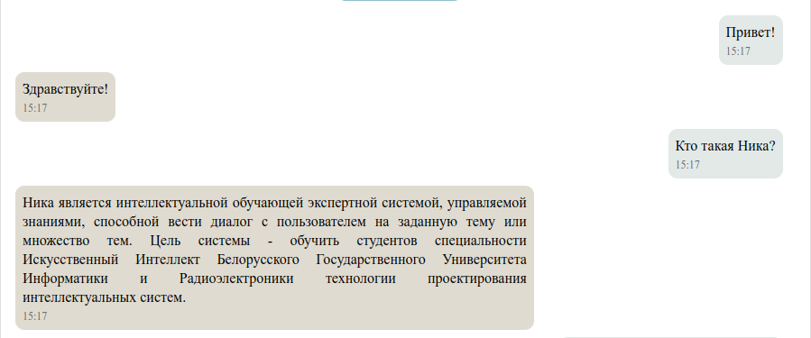
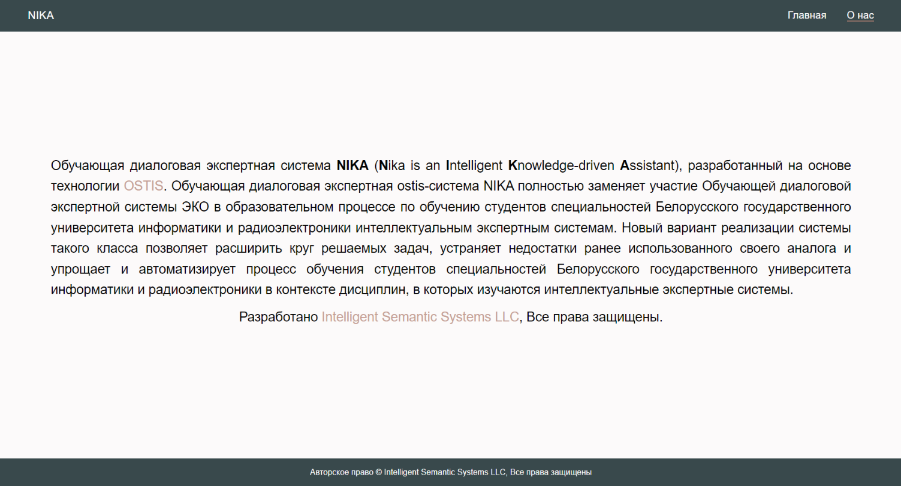
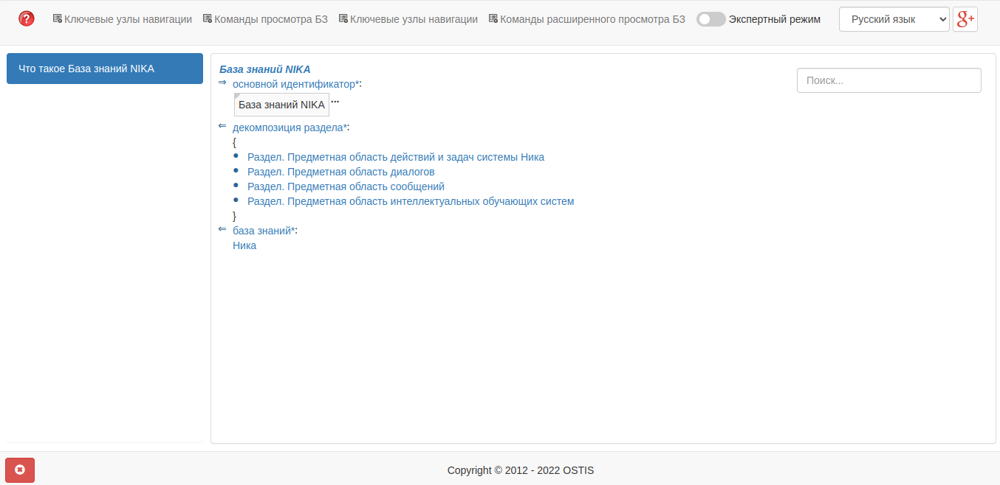
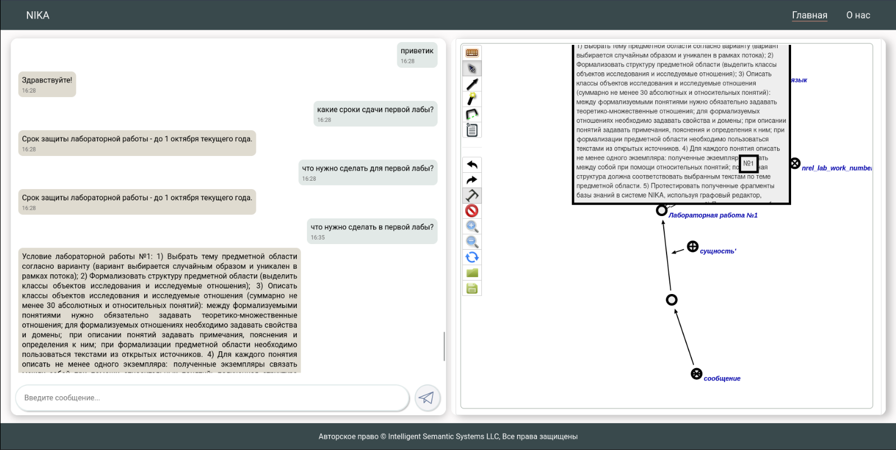

<p align="center">Министерство образования Республики Беларусь</p>
<p align="center">Учреждение образования</p>
<p align="center">"Брестский Государственный технический университет"</p>
<p align="center">Кафедра ИИТ</p>
<br><br><br><br><br><br><br>
<p align="center">Лабораторная работа №4</p>
<p align="center">По дисциплине "Общая теория интеллектуальных систем"</p>
<p align="center">Тема: "Работа с проектом "NIKA" (Intelligent Knowledge-driven Assistant)"</p>
<br><br><br><br><br>
<p align="right">Выполнил:</p>
<p align="right">Студент 2 курса</p>
<p align="right">Группы ИИ-21</p>
<p align="right">Ясюкевич В.С.</p>
<p align="right">Проверил:</p>
<p align="right">Иванюк Д. С.</p>
<br><br><br><br><br>
<p align="center">Брест 2022</p>


---


# Задание

1.  Изучить [руководство](https://github.com/ostis-apps/nika).

2.  Запустить данный проект на локальной машине (домашний персональный компьютер, ноутбук, рабочая машина в аудитории и т.п.). Продемонстрировать работу проекта преподавателю.

3.  Написать отчет по выполненной работе в .md формате (readme.md) и с помощью pull request разместить его в следующем каталоге: trunk\ii0xxyy\task_04\doc.

---
## 1.Общая информация ##
<strong>Ника </strong> является интеллектуальной обучающей экспертной системой, управляемой
знаниями, способной вести диалог с пользователем на заданную тему или
множество тем. 





## 2.Запуск ##
```
docker compose up --no-build
```
### Эта команда запуcкает 2 веб-интерфейса:
<ol>
<li>Sc-веб: <b>localhost:8000</b></li>

<li>Веб-диалог пользовательского интерфейса:<b>localhost:3033</b></li>
</ol>
<h2>3. Веб-интерфейс документации</h2>



<h2>4.Диалоговое окно</h2>


<h2>5.Работа с диалоговым окном</h2>




---

<h1>Вывод</h1>


Видно, что продукт еще находится в разработке.Присутствуют баги и ошибки, но в части "упрощения и автоматизирования процесса обучения студентов" всё работает вполне нормально. 