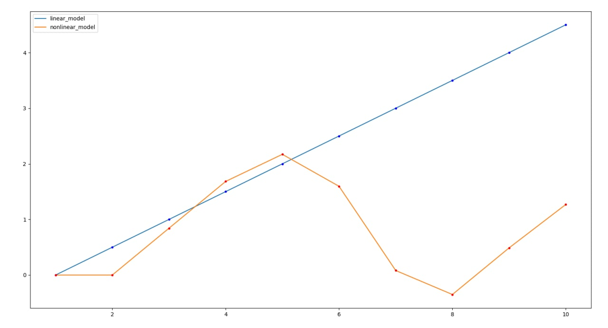

Министерство образования Республики Беларусь

Учреждение образования

“Брестский Государственный технический университет”

Кафедра ИИТ

Лабораторная работа №1

По дисциплине “Общая теория интеллектуальных систем”

Тема: “Моделирования температуры объекта”

Выполнил:

Студент 2 курса

Группы ИИ-21

Кабак Д. Н.

Проверил:

Иванюк Д. С.

Брест 2022

---

# Общее задание #
1. Написать отчет по выполненной лабораторной работе №1 в .md формате (readme.md) и с помощью запроса на внесение изменений (**pull request**) разместить его в следующем каталоге: **trunk\ii0xxyy\task_01\doc** (где **xx** - номер группы, **yy** - номер студента, например **ii02102**).
2. Исходный код написанной программы разместить в каталоге: **trunk\ii0xxyy\task_01\src**.

## Task 1. Modeling controlled object ##
Let's get some object to be controlled. We want to control its temperature, which can be described by this differential equation:

$$\Large\frac{dy(\tau)}{d\tau}=\frac{u(\tau)}{C}+\frac{Y_0-y(\tau)}{RC} $$ (1)

where $\tau$ – time; $y(\tau)$ – input temperature; $u(\tau)$ – input warm; $Y_0$ – room temperature; $C,RC$ – some constants.

After transformation we get these linear (2) and nonlinear (3) models:

$$\Large y_{\tau+1}=ay_{\tau}+bu_{\tau}$$ (2)
$$\Large y_{\tau+1}=ay_{\tau}-by_{\tau-1}^2+cu_{\tau}+d\sin(u_{\tau-1})$$ (3)

where $\tau$ – time discrete moments ($1,2,3{\dots}n$); $a,b,c,d$ – some constants.

Task is to write program (**Julia**), which simulates this object temperature.

---

# Выполнение задания #

Код программы:

    using PyPlot

    y_lin = []
    y_nonlin = []
    
    function linear_model(a, b, y, u, i, t)
        if i <= t
            println(y)
            push!(y_lin, y)
            y_2 = a*y + b*u
            linear_model(a, b, y_2, u, i + 1, t) 
        else
            println("END")
        end
    end

    function nonlinear_model(a, b, c, d, y, y_prev, u, u_prev, i, t)
        if i == 1
            println(y)
            push!(y_nonlin, y)
            y_2 = a*y - b*y_prev^2 + c*0 + d*sin(0)
            nonlinear_model(a, b, c, d, 
                            y_2, y, 
                            u, u,
                            i + 1, t)
        elseif i <= t
            println(y)
            push!(y_nonlin, y)
            y_2 = a*y - b*y_prev^2 + c*u + d*sin(u_prev)
            nonlinear_model(a, b, c, d,
                            y_2, y,
                            u, u, 
                            i + 1, t)
        else
            println("END")
        end
    end

    function main()
        i = 1 
        y = 0.0 
        u = 1.0        
        t = 10 
        a = 1
        b = 0.5
        c = 0.001
        d = 0.999

        println("Linear Model:")
        linear_model(a, b, y, u, i, t)
        println("Nonlinear Model:")
        nonlinear_model(a, b, c, d, y, y, u, u, i, t)

        x = 1:t; y = y_lin; y2 = y_nonlin
        plot(x, y, label="linear_model")
        plot(x, y2, label="nonlinear_model")
        plot(x, y, "b.") 
        plot(x, y2, "r.")
        legend()
    end

    main()
      

Вывод программы:

    
    Linear Model:
    0.0
    0.5
    1.0
    1.5
    2.0
    2.5
    3.0
    3.5
    4.0
    4.5
    END
    Nonlinear Model:
    0.0
    0.0
    0.8416295138230886
    1.6832590276461772
    2.1707184222002214
    1.595667458947133
    0.0812877385305123
    -0.35016006741779937
    0.48816559818758676
    1.2684890756036564
    END

