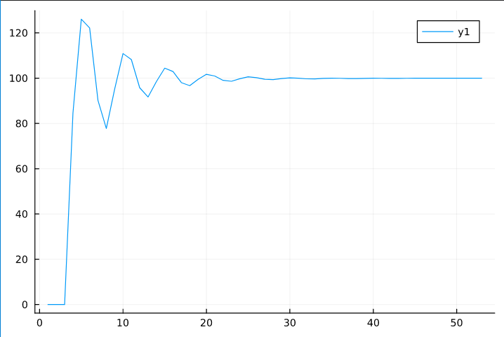

<p align="center"> Министерство образования Республики Беларусь</p>
<p align="center">Учреждение образования</p>
<p align="center">“Брестский Государственный технический университет”</p>
<p align="center">Кафедра ИИТ</p>
<br><br><br><br><br><br><br>
<p align="center">Лабораторная работа №2</p>
<p align="center">По дисциплине “Общая теория интеллектуальных систем”</p>
<p align="center">Тема: “ПИД-регуляторы”</p>
<br><br><br><br><br>
<p align="right">Выполнил:</p>
<p align="right">Студент 2 курса</p>
<p align="right">Группы ИИ-21</p>
<p align="right">Кабак Д. Н.</p>
<p align="right">Проверил:</p>
<p align="right">Иванюк Д. С.</p>
<br><br><br><br><br>
<p align="center">Брест 2022</p>

---

# Общее задание #
1. Написать отчет по выполненной лабораторной работе №1 в .md формате (readme.md) и с помощью запроса на внесение изменений (**pull request**) разместить его в следующем каталоге: **trunk\ii0xxyy\task_02\doc** (где **xx** - номер группы, **yy** - номер студента, например **ii02102**).
2. Исходный код написанной программы разместить в каталоге: **trunk\ii0xxyy\task_02\src**.

# Задание #
На Julia реализовать программу, моделирующую рассмотренный выше ПИД-регулятор.  В качестве объекта управления использовать математическую модель, полученную в предыдущей работе.
В отчете также привести графики для разных заданий температуры объекта, пояснить полученные результаты.

---

# Выполнение задания #

Код программы:
```Julia
    using Plots
    include("param.jl")

    function nonlinear_model(time)
        function l(p)
            return last(y) - p
        end
        i = 0
        while i < time
            e[1] = w - (0)
            e[2] = w - l(1)
            e[3] = w - l(2)
            u[1] = u[2] + q_0 * e[1] + q_1 * e[2] + q_2 * e[3]
            next = p[1]*l(0) - p[2]*l(1)^2 + p[3]*u[1] + p[4]*sin(u[2])
            push!(y, next)
            u[2] = u[1]

            i += 1
        end
    end


    global w = 100
    nonlinear_model(50) 
    for el in y
        println(el)  
    end
    plot(1:length(y), y)
```     
Параметры:
```Julia
    K = 0.0001
    T = 100
    T_D = 100
    T_0 = 1

    q_0 = K * (1 + T_D/T_0)
    q_1 = -K * (1 + 2 * T_D / T_0 - T_0 / T)
    q_2 = K * T_D / T_0

    q = [q_0, q_1, q_2]
    e = [0.0, 0.0, 0.0]
    y = [0.0, 0.0, 0.0]
    u = [1.0, 1.0]

    a = 0.5; b = 0.3; c = 0.9; d = 0.1
    p = [a, b, c, d]
```  

Вывод программы:

    0.0
    0.0
    0.0
    84.53836297180302
    126.04728508479063
    122.18518051036794
    90.16343588054818
    77.79006793920114
    95.20098557579847
    110.8928911427351
    108.22490635768065
    95.76976503363832
    91.6912960458373
    98.4647915963707
    104.42727106418442
    102.91874840613696
    98.01504727307251
    96.69881180878104
    99.45995190843017
    101.70490570553399
    100.94596375950321
    99.02461397231478
    98.62147890796037
    99.75697896452591
    100.59635774159237
    100.23912778318932
    99.49218297698299
    99.38161389742852
    99.85000035563613
    100.1634997538508
    100.00346442057192
    99.71689203565883
    99.69500906755239
    99.88975924522664
    100.00836343243903
    99.94055939301745
    99.83366954690523
    99.8361357221361
    99.9190862885252
    99.96614776428
    99.94017598663457
    99.90310931213295
    99.91094900680983
    99.9484391218655
    99.96951475305146
    99.9621081741686
    99.95205034893307
    99.96032964589857
    99.9794238241535
    99.99117689456655
    99.9918741227413
    99.99221287084308
    100.0

---

