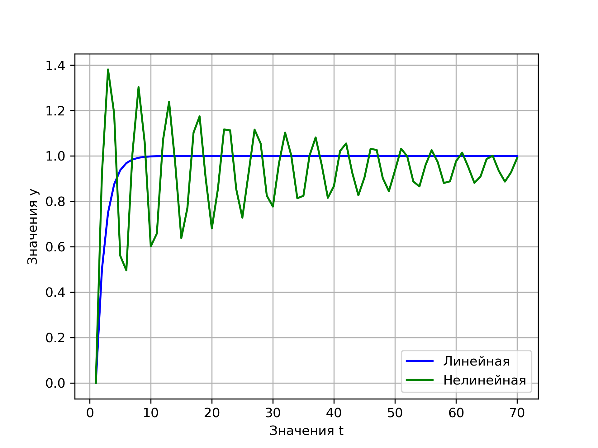

Министерство образования Республики Беларусь

Учреждение образования

"Брестский Государственный технический университет"

Кафедра ИИТ

Лабораторная работа №1

По дисциплине "Общая теория интеллектуальных систем"

Тема: "Моделирования температуры объекта"

Выполнил:

Студент 2 курса

Группы ИИ-21

Карагодин Д. Л.

Проверил:

Иванюк Д. С.

Брест 2022

---

# Общее задание #
1. Написать отчет по выполненной лабораторной работе №1 в .md формате (readme.md) и с помощью запроса на внесение изменений (**pull request**) разместить его в следующем каталоге: **trunk\ii0xxyy\task_01\doc** (где **xx** - номер группы, **yy** - номер студента, например **ii02102**).
2. Исходный код написанной программы разместить в каталоге: **trunk\ii0xxyy\task_01\src**.

## Task 1. Modeling controlled object ##
Let's get some object to be controlled. We want to control its temperature, which can be described by this differential equation:

$$\Large\frac{dy(\tau)}{d\tau}=\frac{u(\tau)}{C}+\frac{Y_0-y(\tau)}{RC} $$ (1)

where $\tau$ – time; $y(\tau)$ – input temperature; $u(\tau)$ – input warm; $Y_0$ – room temperature; $C,RC$ – some constants.

After transformation we get these linear (2) and nonlinear (3) models:

$$\Large y_{\tau+1}=ay_{\tau}+bu_{\tau}$$ (2)
$$\Large y_{\tau+1}=ay_{\tau}-by_{\tau-1}^2+cu_{\tau}+d\sin(u_{\tau-1})$$ (3)

where $\tau$ – time discrete moments ($1,2,3{\dots}n$); $a,b,c,d$ – some constants.

Task is to write program (**Julia**), which simulates this object temperature.

---

# Выполнение задания #

Код программы:

using PyPlot
y_lin = [] # лист для хранения значений y в линейной модели
y_nonlin = [] # лист для хранения значений y в НЕлинейной модели

function nonlinear(a, b, c, d, y, y_prev, u, i, t, u_prev=0)
    if i <= t
        println(y)
        push!(y_nonlin, y)
        nonlinear(a, b, c, d,
                        a*y - b*y_prev^2 + c*u + d*sin(u_prev), y,
                        u, 
                        i + 1, t,u)
    else
        println("End.")
    end
end

function linear(a, b, y, u, i, t)
    if i <= t
        println(y)
        push!(y_lin, y)
        linear(a, b, a*y + b*u, u, i + 1, t) 
    else
        println("End.")
    end
end

function main()
    a = 0.5 # Константа
    b = 0.5 # Константа
    c = 0.5 # Константа
    d = 0.5 # Константа
    i = 1 # Начальное время
    y = 0.0 # Начальная температура
    u = 1.0 # Вводная температура
    t = 15 # Конечное время

    println("Нелинейная модель:")
    nonlinear(a, b, c, d, y, y, u, i, t,u)
    println("Линейная модель:")
    linear(a, b, y, u, i, t)
    plt.grid(true)
    plt.plot(1:t, y_lin,color="blue", label="Линейная")
    plt.plot(1:t, y_nonlin,color="green", label="Нелинейная")
    plt.ylabel("Значения y")
    plt.xlabel("Значения t")
    plt.legend(loc="lower right")
    plt.savefig("grafik1.png",dpi=300)
    #хранится в папке пользователя
    #бывает баг с дублированием  графиков при перезапуске программы 
end

main()
      

Вывод программы:

Нелинейная модель:
0.0
0.9207354924039483
1.3811032386059225
1.1874101882207388
0.5607175086704338
0.49612276919395987
1.011594814736139
1.3034639987156762
1.0608054571612646
0.6016290230106504
0.6588958949377137
1.0692046992084303
1.238265941825278
0.9682691189118923
0.6382187805176731
End.

Линейная модель:
0.0
0.5
0.75
0.875
0.9375
0.96875
0.984375
0.9921875
0.99609375
0.998046875
0.9990234375
0.99951171875
0.999755859375
0.9998779296875
0.99993896484375
End.

