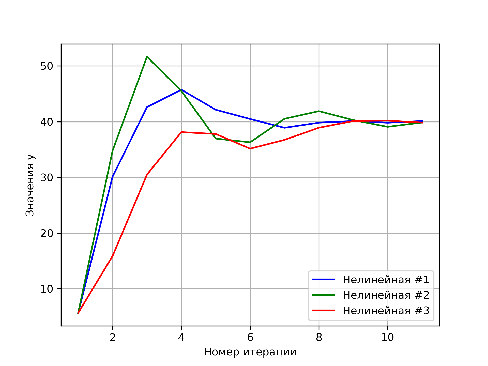

<p align="center">Министерство образования Республики Беларусь</p>
<p align="center">Учреждение образования</p>
<p align="center">"Брестский Государственный технический университет"</p>
<p align="center">Кафедра ИИТ</p>
<br>
<br>
<p align="center">Лабораторная работа №2</p>
<p align="center">По дисциплине: "Общая теория интеллектуальных систем"</p>
<p align="center">Тема: "ПИД-регуляторы"</p>
<br>
<br>
<p align="right">Выполнил:<br>Студент 2 курса<br>Группы ИИ-21<br>Карагодин Д. Л.</p>
<p align="right">Проверил:<br>Иванюк Д. С.</p>
<br>
<p align="center">Брест 2022</p>

---

# Общее задание #
1. Написать отчет по выполненной лабораторной работе №1 в .md формате (readme.md) и с помощью запроса на внесение изменений (**pull request**) разместить его в следующем каталоге: **trunk\ii0xxyy\task_02\doc** (где **xx** - номер группы, **yy** - номер студента, например **ii02102**).
2. Исходный код написанной программы разместить в каталоге: **trunk\ii0xxyy\task_02\src**.

# Задание #
На Julia реализовать программу, моделирующую рассмотренный выше ПИД-регулятор.  В качестве объекта управления использовать математическую модель, полученную в предыдущей работе.
В отчете также привести графики для разных заданий температуры объекта, пояснить полученные результаты.

# Выполнение задания #

Код программы:
```julia
using PyPlot
function nonlinear(Times=10,y_start=2.28,w=25,InputTemperature=1,ConstA=0.5,ConstB=0.5,ConstC=0.5,ConstD=0.5,TransmissionRatio_K=1,T_Step=0.5,T_Diff=1,T_Integral=1)
	RegulatorQ0 =  TransmissionRatio_K * (1+ T_Diff / T_Step )  
	RegulatorQ1 = -TransmissionRatio_K * (1+ 2* T_Diff / T_Step -T_Step / T_Integral)
	RegulatorQ2 =  TransmissionRatio_K * T_Diff / T_Step
	y = [y_start]
	InputTemperature_prev = InputTemperature
	e = [w - y_start, w - y_start]
	for i in 1:Times
		push!(e, w - y[end])
		InputTemperature = InputTemperature_prev + RegulatorQ0 * e[end] + RegulatorQ1 * e[end - 1] + RegulatorQ2 * e[end - 2]
		if(length(y)==1)
			push!(y,ConstA * y[end] - ConstB * y[end] + ConstC * InputTemperature + ConstD * sin(InputTemperature_prev))
		else
			push!(y,ConstA * y[end] - ConstB * y[end-1] + ConstC * InputTemperature + ConstD * sin(InputTemperature_prev))
		end
		InputTemperature_prev = InputTemperature
	end
	println("Нелинейная модель:")
	for i in y
		println(i)
	end
	return y
end

function main()
InputTemperature=1.5
ConstA = 0.6
ConstB = 0.5
ConstC = 0.7
ConstD = 0.4
TransmissionRatio_K = 0.9
T_Step = 1.3
T_Diff = 1.2
T_Integral = 1
y_start = 5.67
w=40;
plt.grid(true)
plt.ylabel("Значения y")
plt.xlabel("Номер итерации")

y=nonlinear(10,y_start,w,InputTemperature,ConstA,ConstB,ConstC,ConstD,TransmissionRatio_K,T_Step,T_Diff,T_Integral)
plt.plot(1:length(y),y,color="Blue", label="Нелинейная #1")
y=nonlinear(10,y_start,w,InputTemperature,ConstA,ConstB,ConstC,ConstD,1.0,1.5,0.9,1.1)
plt.plot(1:length(y),y,color="Green", label="Нелинейная #2")
y=nonlinear(10,y_start,w,InputTemperature,ConstA,ConstB,ConstC,ConstD,0.5,1.5,0.7,1.3)
plt.plot(1:length(y),y,color="Red", label="Нелинейная #3")
plt.legend(loc="lower right")
plt.savefig("grafik1.png",dpi=300)
end
main()
      
```
Вывод программы:
```julia
Нелинейная модель:
5.67
30.13226799464162
42.59599582628298
45.73419032840555
42.13192713465045
40.47251646573637
38.89658969863918
39.81423332527469
40.10350714455503
39.80504435492194
40.10421362705525
Нелинейная модель:
5.67
34.78554344918706
51.644698417962246
45.50206911591181
36.958827668996754
36.28812666388951
40.50651318773338
41.88015493350423
40.27988897567786
39.06972812678274
39.8423003760552
Нелинейная модель:
5.67
15.88003645618008
30.483133444273243
38.12036913809389
37.78714302367947
35.14873775633166
36.72304779837249
38.908556619278485
40.10516188314309
40.16819934610378
39.82808581350823
```

