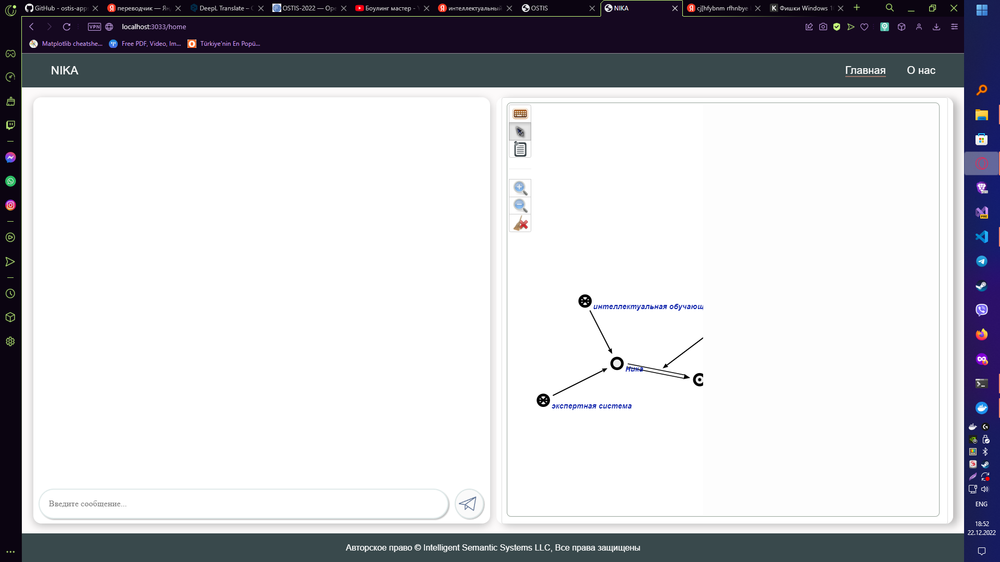
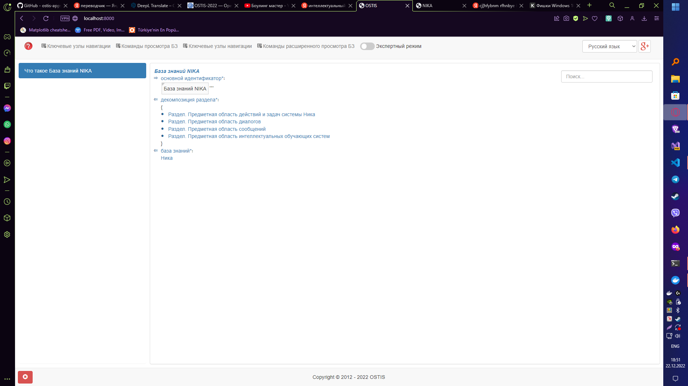
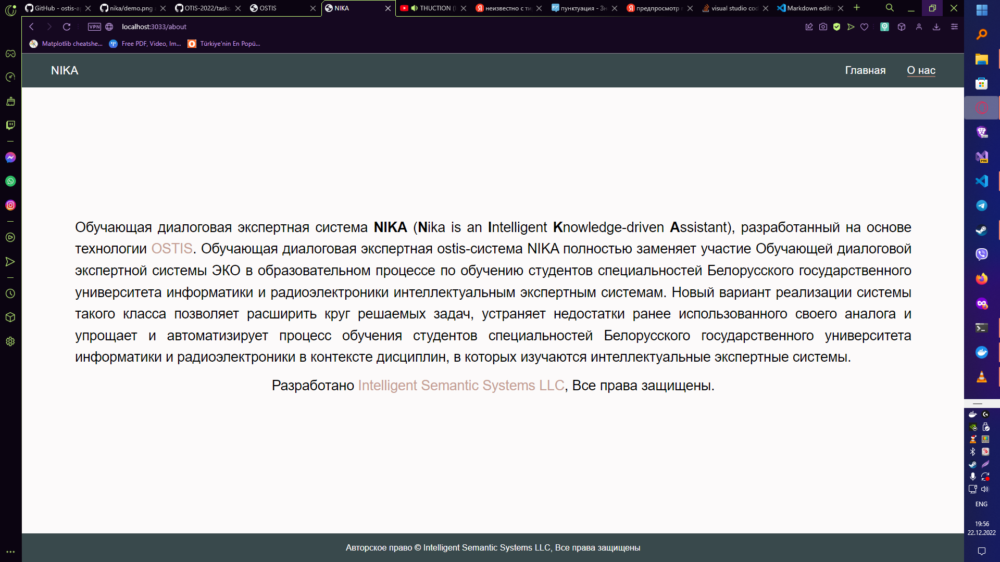

Министерство образования Республики Беларусь

Учреждение образования

"Брестский Государственный технический университет"

Кафедра ИИТ

       

Лабораторная работа №4

По дисциплине "Общая теория интеллектуальных систем"

Тема: "Работа с проектом "NIKA" (Intelligent Knowledge-driven Assistant)"

     

Выполнил:

Студент 2 курса

Группы ИИ-21

Карагодин Д. Л.

Проверил:

Иванюк Д. С.

     

Брест 2022

---

# Задание

1.  Изучить [руководство](https://github.com/ostis-apps/nika).

2.  Запустить данный проект на локальной машине (домашний персональный компьютер, ноутбук, рабочая машина в аудитории и т.п.). Продемонстрировать работу проекта преподавателю.

3.  Написать отчет по выполненной работе в .md формате (readme.md) и с помощью pull request разместить его в следующем каталоге: trunk\ii0xxyy\task_04\doc.

---
>NIKA - интеллектуальный помощник, управляемый знаниями. 

Яркие примеры подобных помощников Alexa от Amazon; Assistant от Google; Cortana от Microsoft; Алиса от Яндекс.

Оболочка,которая используется для работы с программой: Подсистема Windows для Linux (wsl.exe)

# Веб-интерфейсы
При запуске программы по адресам localhost:3033 и localhost:8000 запускаются веб-интерфейсы диалога с помощником и документации соотвественно.

---

# Работа с диалоговым окном
Введём команды в диалоговое окно,имеющиеся в документации проекта на гитхабе:

Как мы видим,помощник отвечает разными репликами, отличающимися от исходного примера, что приятно удивляет. Также можем заметить,что справа иллюстрируется процесс мышления помощника в виде графов.
# Работа с диалоговым окном №2
Попробуем перефразировать данные команды:

Как мы видим,помощник отвечает также на вопросы,перефразированные мной.

# Работа с диалоговым окном №3
Попробуем ввести команды никак не связанные c этими командами:

Как мы видим,команда отвечает в форме: "Я не знаю,сформулируйте по-другому".Также были замечены некоторые баги и ошибки в консоли при вводе некоторых команд.

# Работа с графом
Попробуем поработать с графом,показывающимся при вводе команды:

Были замечены базовые операции с графами: 
* Добавление\удаление вершин\дуг.
* Возврат\обратный возврат графа.
* Сохранение\загрузка графа.

Были замечены операции с нейкими SCg-шинами. В ходе манипуляций с командами возврата была утеряна вершина(баг или моя неправильная последовательность действий - неизвестно).

# О нас
Посмотрим, что написано в подстранице "О нас":

Здесь мы видим вкратце описание:
* Что это.
* Для каких целей реализовано.
* Кем разработано.

# Документация

Рассмотрим все пункты всех подменю. Можно сразу увидеть два одинаковых подменю, зачем так сделано? Неизвестно. Рассмотрим пункт "Часто задаваемые вопросы". Выберем любой пункт и вкратце пробежимся по разделу. 

# Выводы

После некоторого времени использования видно, что продукт еще находится в разработке. Заметно, что проделана большая работа над этим проектом. Встречались некоторые баги и ошибки, но в части "упрощения и автоматизирования процесса обучения студентов" всё работает вполне стабильно. Желаем удачи в дальнейшей разработке.
 