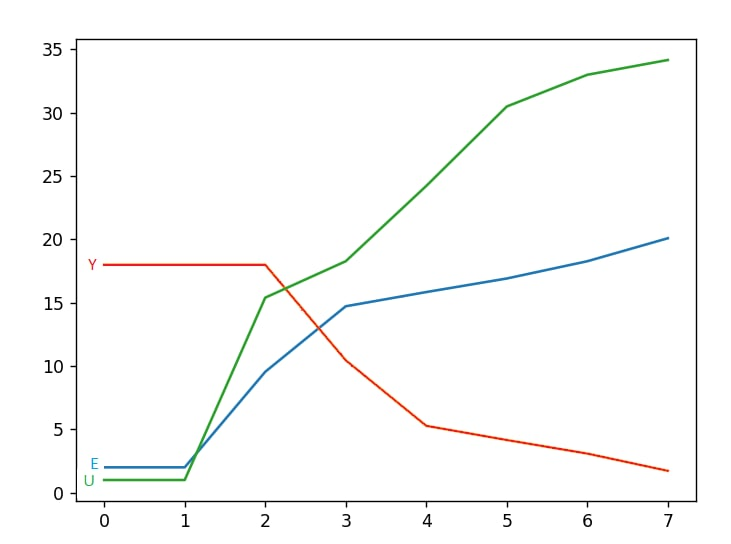

<p align="center">Министерство образования Республики Беларусь</p>
<p align="center">Учреждение образования</p>
<p align="center">"Брестский Государственный технический университет"</p>
<p align="center">Кафедра ИИТ</p>
<br>
<br>
<p align="center">Лабораторная работа №2</p>
<p align="center">По дисциплине: "Общая теория интеллектуальных систем"</p>
<p align="center">Тема: "ПИД-регуляторы"</p>
<br>
<br>
<p align="right">Выполнил:<br>Студент 2 курса<br>Группы ИИ-21<br>Пучинский А.А.</p>
<p align="right">Проверил:<br>Иванюк Д. С.</p>
<br>
<p align="center">Брест 2022</p>

---

# Общее задание #
1. Написать отчет по выполненной лабораторной работе №2 в .md формате (*readme.md*) и с помощью **pull request** разместить его в следующем каталоге: **trunk\as000xxyy\task_02\doc**.
2. Исходный код написанной программы разместить в каталоге: **trunk\as000xxyy\task_02\src**.
---

# Выполнение задания #

Код программы:
```julia

function нелинейный(A,B,C,D,K,T0,TD,T,W,YS)
        q0 =  K * (1 + (TD / T0))  
        q1 = -K * (1 + 2 * (TD / T0) - (T0 / T))
        q2 =  K * (TD / T0)
        y = [YS, YS]
        U = 1.0
        U_pre = 1.0
        E = [W - YS, W - YS]
        um = [U,U]
    #counting values
        while abs(y[end] - W) > 0.1
            push!(E, W - y[end])
             U = U_pre + q0 * E[end] + q1 * E[end - 1] + q2 * E[end - 2]
            push!(y, A * y[end] - B * y[end - 1] + C * U + D * sin(U_pre))
            U_pre = U
            push!(um,U)
        end
    #conclesion
    println("Y")
        for i in 1:length(y)
            println(y[i])
        end	
        println(" ")
        println("E")
        for i in 1:length(E)
            println(E[i])
        end
        println(" ")
        println("U")
        for i in 1:length(um)
            println(um[i])
        end
    end
    function main()
    #parameter initialization
        A = 0.5
        B = 0.6
        C = 0.6
        D = 0.6
        K = 0.8
        T0 = 1.1
        TD = 1
        T = 1.1
    #initial value and sedired result 
        YS = 2.0
        W = 20
        нелинейный(A,B,C,D,K,T0,TD,T,W,YS)
    end
    main()
```
Вывод программы:
```
Y       
2.0
2.0
9.544882590884736
14.720456262569957
15.842387402415573
16.91428333501587
18.276754241422516
20.091789874818467

E
18.0
18.0
18.0
10.455117409115264
5.279543737430043
4.157612597584427
3.0857166649841297
1.7232457585774839

U
1.0
1.0
15.399999999999997
18.276906588466943
24.2236753378288
30.497869075416055
33.00283164903632
34.17010100222095
```
