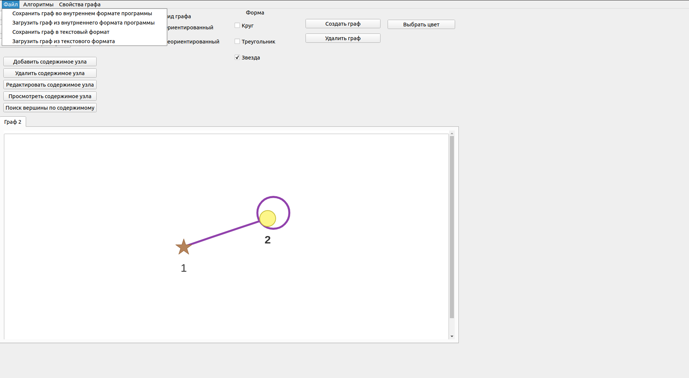

 Министерство образования Республики Беларусь

Учреждение образования

“Брестский Государственный технический университет”

Кафедра ИИТ

       

Лабораторная работа №3

По дисциплине “Общая теория интеллектуальных систем”

Тема: “Разработка редактора графов”

     

Выполнил:

Студент 2 курса

Группы ИИ-21

Шпак И.С.

Проверил:

Иванюк Д. С.

     

Брест 2022

---
# Задание: #
1. Разработать и реализовать программный продукт позволяющий
редактировать графовые конструкции различных видов и производить над
ними различные действия. Язык программирования - любой.

2. Редактор должен позволять (задания со **[\*]** являются необязательными):  
  a) одновременно работать с несколькими графами (MDI);  
  b) **[\*]** выделение одновременно нескольких элементов графа, копирование
выделенного фрагмента в clipboard и восстановление из него;  
  c) задавать имена графам;  
  d) сохранять и восстанавливать граф во внутреннем формате программы;  
  e) экспортировать и импортировать граф в текстовый формат (описание
см. ниже);  
  f) создавать, удалять, именовать, переименовывать, перемещать узлы;  
  g) создавать ориентированные и неориентированные дуги, удалять дуги;  
  h) добавлять, удалять и редактировать содержимое узла (содержимое в
виде текста и ссылки на файл);  
  i) задавать цвет дуги и узла, образ узла;  
  j) **[\*]** создавать и отображать петли;  
  k) **[\*]** создавать и отображать кратные дуги.

3. Программный продукт должен позволять выполнять следующие операции:  
    a) выводить информацию о графе:

    + количество вершин, дуг;
    + степени для всех вершин и для выбранной вершины;
    + матрицу инцидентности;
    + матрицу смежности;
    + является ли он деревом, полным, связанным, эйлеровым, **[\*]** планарным;

    b) поиск всех путей (маршрутов) между двумя узлами и кратчайших;  
    c) вычисление расстояния между двумя узлами;  
    d) вычисление диаметра, радиуса, центра графа;  
    e) **[\*]** вычисление векторного и декартово произведения двух графов;  
    f) **[\*]** раскраска графа;  
    g) нахождения эйлеровых, [*] гамильтоновых циклов;  
    h) **[\*]** поиск подграфа в графе, со всеми или некоторыми неизвестными
    узлами;  
    i) **[\*]** поиск узла по содержимому;  
    j) **[\*]** объединение, пересечение, сочетание и дополнение графов;  
    k) **[\*]** приведение произвольного графа к определенному типу с
    минимальными изменениями:

    + бинарное и обычное дерево;
    + полный граф;
    + планарный граф;
    + связанный граф;

4. Формат текстового представления графа:
<ГРАФ> ::= <ИМЯ ГРАФА> : UNORIENT | ORIENT ; <ОПИСАНИЕ УЗЛОВ> ;
<ОПИСАНИЕ СВЯЗЕЙ> .
<ИМЯ ГРАФА> ::= <ИДЕНТИФИКАТОР>
<ОПИСАНИЕ УЗЛОВ> ::= <ИМЯ УЗЛА> [ , <ИМЯ УЗЛА> …]
<ИМЯ УЗЛА> ::= <ИДЕНТИФИКАТОР>
<ОПИСАНИЕ СВЯЗЕЙ> ::= <ИМЯ УЗЛА> -> <ИМЯ УЗЛА> [ , <ИМЯ УЗЛА> …] ;
[<ОПИСАНИЕ СВЯЗЕЙ> …]

5. Написать отчет по выполненной лабораторной работе в .md формате (readme.md). Разместить его в следующем каталоге: **trunk\ii0xxyy\task_03\doc** (где **xx** - номер группы, **yy** - номер студента, например **ii02102**). 

6. Исходный код разработанной программы разместить в каталоге: **trunk\ii0xxyy\task_03\src**.

---
 

---
 

# Описание работы программы: #
## Окно программы

## Создаем вершины

## Соединяем вершины ребрами

## Задаём цвет дуги,узла,образ узла 

## Создаём неориентированный и ориентированный графы
В то же время задаём имена графам.

Также создаём и отображаем петли

## Поиск путей между двумя вершинами

## Поиск кратчайших путей между двумя вершинами

## Вычисление расстояния между двумя вершинами

## Поиск Гамильтонова и Эйлерова цикла

## Матрица инцидентности  

## Матрица смежности

## Количество вершин, дуг 

## Степени для всех вершин и для выбранной вершины 

## Вычисление диаметра, радиуса, центра графа

## Является ли он деревом, полным, связанным, эйлеровым, [*] планарным

## Программа позволяет сохранять и восстанавливать граф во внутреннем формате программы экспортировать и импортировать граф в текстовый формат

## Программа позволяет добавлять, удалять и редактировать содержимое узла (содержимое в виде текста и ссылки на файл)

## Можем работать одновременно с несколькими графами

