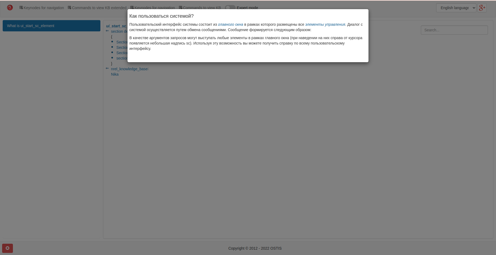

 Министерство образования Республики Беларусь

Учреждение образования

“Брестский Государственный технический университет”

Кафедра ИИТ

       

Лабораторная работа №5

По дисциплине “Общая теория интеллектуальных систем”

Тема: “Работа с проектами”

     

Выполнил:

Студент 2 курса

Группы ИИ-21

Шпак И.С.

Проверил:

Иванюк Д. С.

     

Брест 2022

---
# Общее задание #
1. Изучить следующие открытые проекты:
   1. 1. The OSTIS Technology project;
   2. 2. The OSTIS Applications;

2. Внести свой вклад в проект (в виде оформления вопросов (issues)):
    - предложить исправления в ошибках в документации (синтаксические, орфографические и т.п.);
    - предложить исправления в исходном коде;
    - предложить новую функциональность.
3. Написать отчет по выполненной работе в .md формате (readme.md) и с помощью pull request разместить его в следующем каталоге: trunk\ii0xxyy\task_05\doc.

---

# Выполнение задания #
При работе с sc-web(http://localhost:8000), мною была найдена ошибка в переводе, о которой я сообщил в репозитории проекта https://github.com/ostis-apps/nika/issues/177

