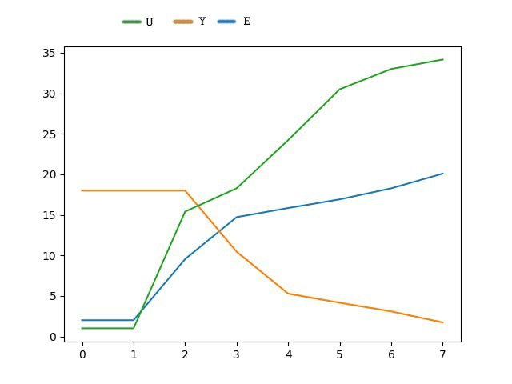

<p align="center"> Министерство образования Республики Беларусь</p>
<p align="center">Учреждение образования</p>
<p align="center">“Брестский Государственный технический университет”</p>
<p align="center">Кафедра ИИТ</p>
<br><br><br><br><br><br><br>
<p align="center">Лабораторная работа №2</p>
<p align="center">По дисциплине “Общая теория интеллектуальных систем”</p>
<p align="center">Тема: “ПИД-регуляторы”</p>
<br><br><br><br><br>
<p align="right">Выполнил:</p>
<p align="right">Студент 2 курса</p>
<p align="right">Группы ИИ-21</p>
<p align="right">Шурина А. А.</p>
<p align="right">Проверил:</p>
<p align="right">Иванюк Д. С.</p>
<br><br><br><br><br>
<p align="center">Брест 2022</p>


---
# Задание: #
На Julia реализовать программу, моделирующую рассмотренный выше ПИД-регулятор. В качестве объекта управления использовать математическую модель, полученную в предыдущей работе. В отчете также привести графики для разных заданий температуры объекта, пояснить полученные результаты.

---
# Код программы #
```julia
function nonliney(J,G,V,B,L,T0,TD,T,w,ys)
#ПИН регулятор
 q0 = L * (1 + (TD / T0)) 
 q1 = -L * (1 + 2 * (TD / T0) - (T0 / T))
 q2 = L * (TD / T0)
 y = [ys, ys]
 u = 1.0
 u_prev = 1.0
 e = [w - ys, w - ys]
 um = [u,u]
 #подсчитаем значения
 while abs(y[end] - w) > 0.1
  push!(e, w - y[end])
   u = u_prev + q0 * e[end] + q1 * e[end - 1] + q2 * e[end - 2]
  push!(y, J * y[end] - G * y[end - 1] + V * u + B * sin(u_prev))
     u_prev = u
  push!(um,u)
 end
 #сделаем вывод
println("P")
 for i in 1:length(p)
  println(y[i])
 end 
 println(" ")
 println("O")
 for i in 1:length(o)
  println(e[i])
 end
 println(" ")
 println("U")
 for i in 1:length(um)
  println(um[i])
 end
end
function main()
#Инициализируем параметры
 J = 0.4
 G = 0.7
 V = 0.8
 B = 0.5
 L = 0.7
 T0 = 1.1
 TD = 1
 T = 1.1
 #укажем начальные значения и требуемый результат
 ys = 2.0
 w = 20
 nonliney(J,G,V,B,L,T0,TD,T,w,ys)
end
main()
```

# Вывод #
```
P
2.0
2.0
10.700735492403949
14.967997887056153
15.6831015773907
17.194307468116506
18.461985269608657
18.74869358792449
18.59853381488616
19.204601018017865
20.155165682311385
19.88527960114664
19.635960158131372
20.300080939435666
20.17669045519132
19.6651124219771
20.098884241544393
 
O
18.0
18.0
18.0
9.299264507596051
5.032002112943847
4.316898422609301
2.805692531883494
1.5380147303913425
1.251306412075511
1.40146618511384
0.7953989819821352
-0.1551656823113845
0.11472039885336116
0.36403984186862814
-0.3000809394356665
-0.17669045519131998
0.3348875780229008
 
U
1.0
1.0
13.6
14.572653478332905
20.916356019599256
26.198649545446095
27.656023826606468
28.887606558301826
30.387774354230526
31.646807651035594
31.722351589951245
31.3945099552303
32.25146470881018
32.49320473747764
31.701867937123865
32.0793281511118
32.56077789598139
```
---
# График #

