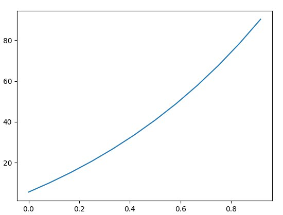
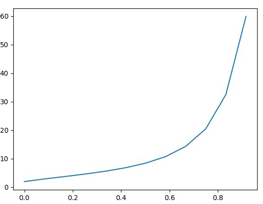

<p align="center">Министерство образования Республики Беларусь</p>
<p align="center">Учреждение образования</p>
<p align="center">"Брестский Государственный технический университет"</p>
<p align="center">Кафедра ИИТ</p>
<br>
<br>
<p align="center">Лабораторная работа №1</p>
<p align="center">По дисциплине: "Общая теория интеллектуальных систем"</p>
<p align="center">Тема: "Моделирования температуры объекта"</p>
<br>
<br>
<p align="right">Выполнил:<br>Студент 2 курса<br>Группы ИИ-21<br>Ясюкевич В.С.</p>
<p align="right">Проверил:<br>Иванюк Д. С.</p>
<br>
<p align="center">Брест 2022</p>

---

# Общее задание #
1. Написать отчет по выполненной лабораторной работе №1 в .md формате (readme.md) и с помощью запроса на внесение изменений (**pull request**) разместить его в следующем каталоге: **trunk\ii0xxyy\task_01\doc** (где **xx** - номер группы, **yy** - номер студента, например **ii02102**).
2. Исходный код написанной программы разместить в каталоге: **trunk\ii0xxyy\task_01\src**.

## Task 1. Modeling controlled object ##
Let's get some object to be controlled. We want to control its temperature, which can be described by this differential equation:

$$\Large\frac{dy(\tau)}{d\tau}=\frac{u(\tau)}{C}+\frac{Y_0-y(\tau)}{RC} $$ (1)

where $\tau$ – time; $y(\tau)$ – input temperature; $u(\tau)$ – input warm; $Y_0$ – room temperature; $C,RC$ – some constants.

After transformation we get these linear (2) and nonlinear (3) models:

$$\Large y_{\tau+1}=ay_{\tau}+bu_{\tau}$$ (2)
$$\Large y_{\tau+1}=ay_{\tau}-by_{\tau-1}^2+cu_{\tau}+d\sin(u_{\tau-1})$$ (3)

where $\tau$ – time discrete moments ($1,2,3{\dots}n$); $a,b,c,d$ – some constants.

Task is to write program (**Julia**), which simulates this object temperature.

---

# Выполнение задания #

Код программы:
```julia
function LinearModels(a, b, yt,ut ,time) i = 1
    for i in i:time 
        yt = a * yt + b * ut
        println(yt)    
    end
end

function NoLinearModels(a, b, c, d, yt, ut, time) i = 1
    y=0.0
    for i in i : time 
        ut1 = ut
        yt1 = y
        y = yt
        yt = a * yt - b * yt1 ^ 2 + c * ut + d * sin(ut1)
        println(yt)  
    end
end

function main()   
    time=12

    a=1.1;b=1;yt=1.5;ut=4  

    println("\nЛинейная модель:\n")
    LinearModels(a,b,yt,ut,time)

    a=0.5; b=-0.1 ;c = 1;d=0.1;yt=0.1;ut=1.8

    println("\nНелинейная модель:\n")
    NoLinearModels(a, b, c, d, yt, ut,time)    
end
main()   
      
```
Вывод программы:
```
Линейная модель:

1|5.65
2|10.215
3|15.236500000000001
4|20.760150000000003
5|26.836165000000005
6|33.51978150000001
7|40.87175965000001
8|48.958935615000016
9|57.85482917650002
10|67.64031209415003
11|78.40434330356504
12|90.24477763392156

Нелинейная модель:

1|1.9473847630878196
2|2.8720771446317293
3|3.712654076954345
4|4.5785945140365865
5|5.5650620496186844
6|6.7762685602937545
7|8.382510604845308
8|10.680421625633034
9|14.264243979938744
10|20.43664736318617
11|32.46257407660277
12|59.89432734611164
End.
```

