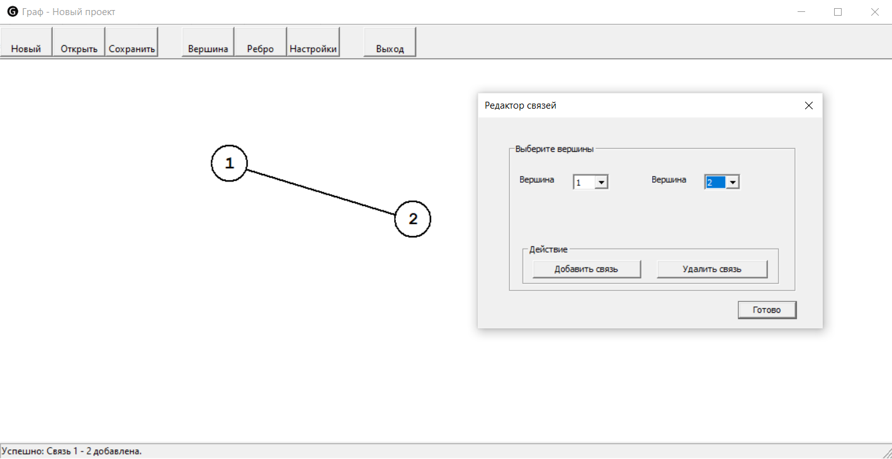
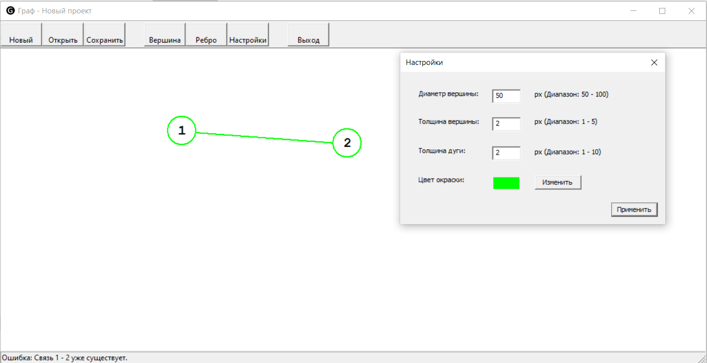
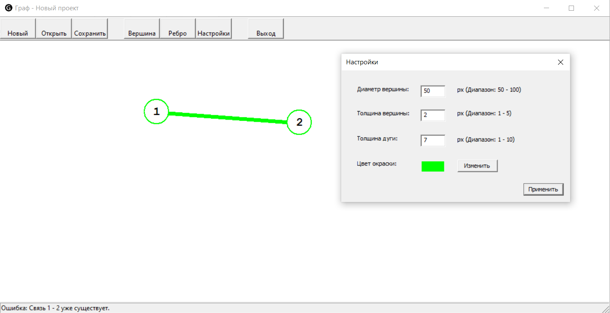
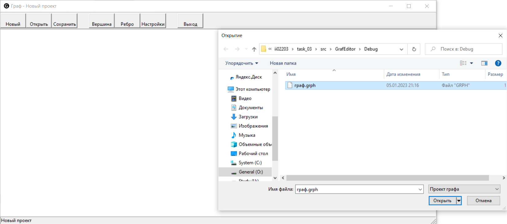

Министерство образования Республики Беларусь

Учреждение образования

“Брестский Государственный Технический Университет”

Кафедра ИИТ

Лабораторная работа №3

По дисциплине “Общая теория интеллектуальных систем”

Тема: “Работа с графами”

Выполнил:

Студент 2 курса

Группы ИИ-22(II)

Гузаревич Д.А.

Проверил:

Иванюк Д. С.

Брест 2022

---
## Общее задание ##
1. Разработать и реализовать программный продукт позволяющий редактировать графовые конструкции различных видов и производить над ними различные действия. Язык программирования - любой.

2. Редактор должен позволять (задания со [*] являются необязательными):
a) одновременно работать с несколькими графами (MDI);
b) [*] выделение одновременно нескольких элементов графа, копирование выделенного фрагмента в clipboard и восстановление из него;
c) задавать имена графам;
d) сохранять и восстанавливать граф во внутреннем формате программы;
e) экспортировать и импортировать граф в текстовый формат (описание см. ниже);
f) создавать, удалять, именовать, переименовывать, перемещать узлы;
g) создавать ориентированные и неориентированные дуги, удалять дуги;
h) добавлять, удалять и редактировать содержимое узла (содержимое в виде текста и ссылки на файл);
i) задавать цвет дуги и узла, образ узла;
j) [*] создавать и отображать петли;
k) [*] создавать и отображать кратные дуги.

3. Программный продукт должен позволять выполнять следующие операции:
a) выводить информацию о графе:
- количество вершин, дуг;
- степени для всех вершин и для выбранной вершины;
- матрицу инцидентности;
- матрицу смежности;
- является ли он деревом, полным, связанным, эйлеровым, [*] планарным;
b) поиск всех путей (маршрутов) между двумя узлами и кратчайших;
c) вычисление расстояния между двумя узлами;
d) вычисление диаметра, радиуса, центра графа;
e) [*] вычисление векторного и декартово произведения двух графов;
f) [*] раскраска графа;
g) нахождения эйлеровых, [*] гамильтоновых циклов;
h) [*] поиск подграфа в графе, со всеми или некоторыми неизвестными узлами;
i) [*] поиск узла по содержимому;
j) [*] объединение, пересечение, сочетание и дополнение графов;
k) [*] приведение произвольного графа к определенному типу с минимальными изменениями:

- бинарное и обычное дерево;
- полный граф;
- планарный граф;
- связанный граф;

4. Формат текстового представления графа: <ГРАФ> ::= <ИМЯ ГРАФА> : UNORIENT | ORIENT ; <ОПИСАНИЕ УЗЛОВ> ; <ОПИСАНИЕ СВЯЗЕЙ> . <ИМЯ ГРАФА> ::= <ИДЕНТИФИКАТОР> <ОПИСАНИЕ УЗЛОВ> ::= <ИМЯ УЗЛА> [ , <ИМЯ УЗЛА> …] <ИМЯ УЗЛА> ::= <ИДЕНТИФИКАТОР> <ОПИСАНИЕ СВЯЗЕЙ> ::= <ИМЯ УЗЛА> -> <ИМЯ УЗЛА> [ , <ИМЯ УЗЛА> …] ; [<ОПИСАНИЕ СВЯЗЕЙ> …]

5. Написать отчет по выполненной лабораторной работе в .md формате (readme.md). Разместить его в следующем каталоге: trunk\ii0xxyy\task_03\doc (где xx - номер группы, yy - номер студента, например ii02102).

6. Исходный код разработанной программы разместить в каталоге: trunk\ii0xxyy\task_03\src.

## Ход работы ##
### Внешний вид программы ###

### Создание вершины ###

### Добавление дуги ###

### Изменение цвета/толщины дуги/вершины ###

### Сохранение/открытие графы ###

