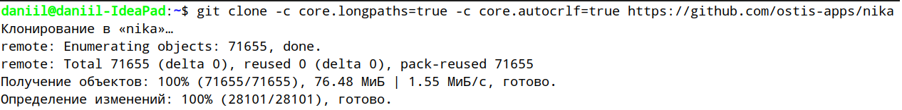
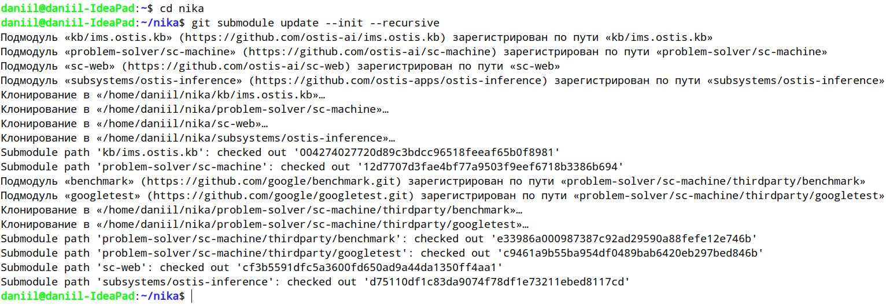
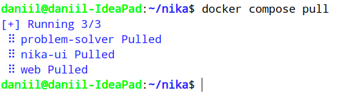
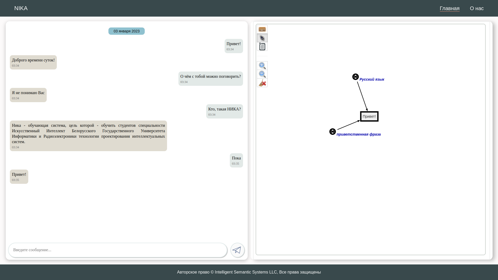
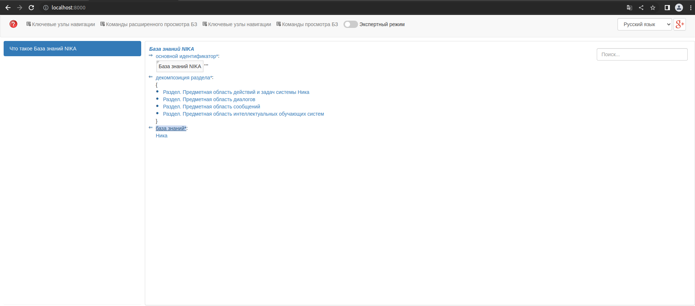
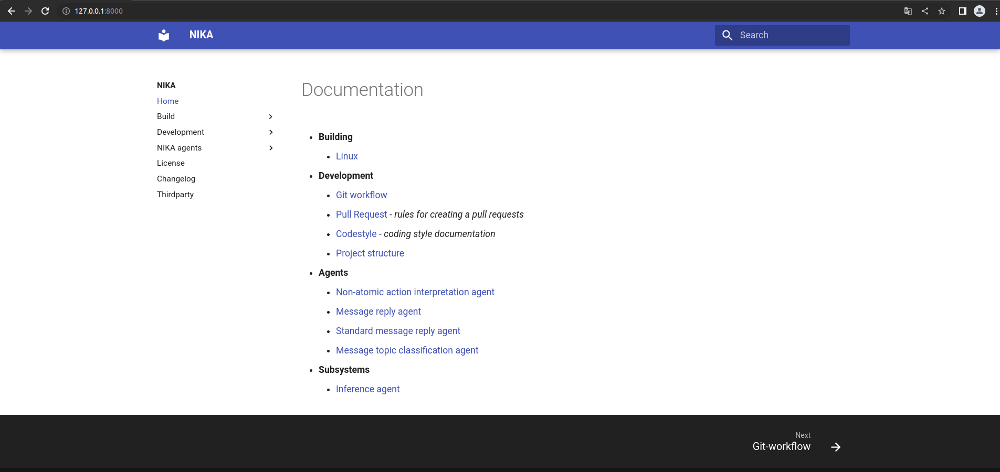

Министерство образования Республики Беларусь

Учреждение образования

“Брестский Государственный Технический Университет”

Кафедра ИИТ

Лабораторная работа №4

По дисциплине “Общая теория интеллектуальных систем”

Тема: “Работа с проектом "NIKA" (Intelligent Knowledge-driven Assistant)”

Выполнил:

Студент 2 курса

Группы ИИ-22(II)

Гузаревич Д.А.

Проверил:

Иванюк Д. С.

Брест 2022

---
## Общее задание ##
1.  Изучить [руководство](https://github.com/ostis-apps/nika).

2.  Запустить данный проект на локальной машине (домашний персональный компьютер, ноутбук, рабочая машина в аудитории и т.п.). Продемонстрировать работу проекта преподавателю.

3.  Написать отчет по выполненной работе в .md формате (readme.md) и с помощью pull request разместить его в следующем каталоге: trunk\ii0xxyy\task_04\doc.

---
# Ход работы #
Работа выполнялась на дистрибутиве Linux Ubuntu 20.04 LTS. 
## 1. Установка и запуск ##

## 2. Работа проекта ##

## 3. sc-web ##

## 4. Documentation ##

---