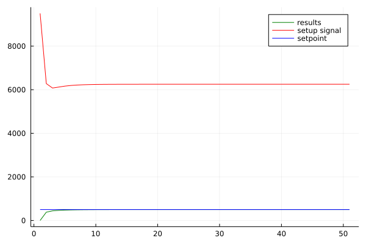

Министерство образования Республики Беларусь <br/>
Учреждение образования <br/>
«Брестский государственный технический университет» <br/>
Кафедра ИИТ <br/>

Лабораторная работа №2 <br/>
За третий семестр <br/>
По дисциплине: «Общая теория интеллектуальных систем» <br/>
Тема: «ПИД-регуляторы» <br/>

Выполнил: <br/>
Студент 1 курса <br/>
Группы ИИ-21(I) <br/>
Заречный А.О. <br/>

Проверил: <br/>
Иванюк Д.С. <br/>

Брест 2022 <br/>

# Общее задание #
1. Написать отчет по выполненной лабораторной работе №2 в .md формате (*readme.md*) и с помощью **pull request** разместить его в следующем каталоге: **trunk\as000xxyy\task_02\doc**.
2. Исходный код написанной программы разместить в каталоге: **trunk\as000xxyy\task_02\src**.
На Julia реализовать программу, моделирующую рассмотренный выше ПИД-регулятор.  В качестве объекта управления использовать математическую модель, полученную в предыдущей работе.
## Код программы ##

``` julia
 using Plots

function main()
    # pid setups
    kp = 11
    ki = 8
    kd = 0
    t = 0
    dt = 1
    T = 50
    setpoint = 500
    in = 0
    prevErr = 0
    i = 0 
    # models setups
    a = 0.5
    b = 0.04
    #plots data
    outs = []
    results = []
    times = []
    setpoints = []

    while T >= t
        # count pid coefficients
        err = setpoint - in 
        i += err * dt
        out = kp * err + ki * i + kd * (err-prevErr) / dt         
        prevErr = err

        if out < 0
            out = 0
        end
        #write data in arrays to draw a graph
        for i in 1:1
            push!(results,in)
            push!(times,t * 1 + i)
            push!(outs,out)
            push!(setpoints,setpoint)
        end
        # in = y(t), y(t) - functional dependence value
        in = a * in + b * out
        t += dt
    end
    plot(times, results, color = :green, label = "results")
    plot!(times, outs, color = :red, label = "setup signal")
    plot!(times, setpoints, color = :blue, label = "setpoint")
end

main()
```
# Результаты выполнения программы: #
