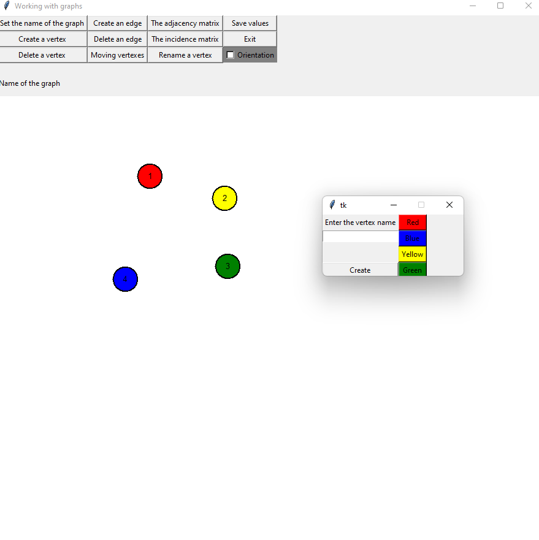
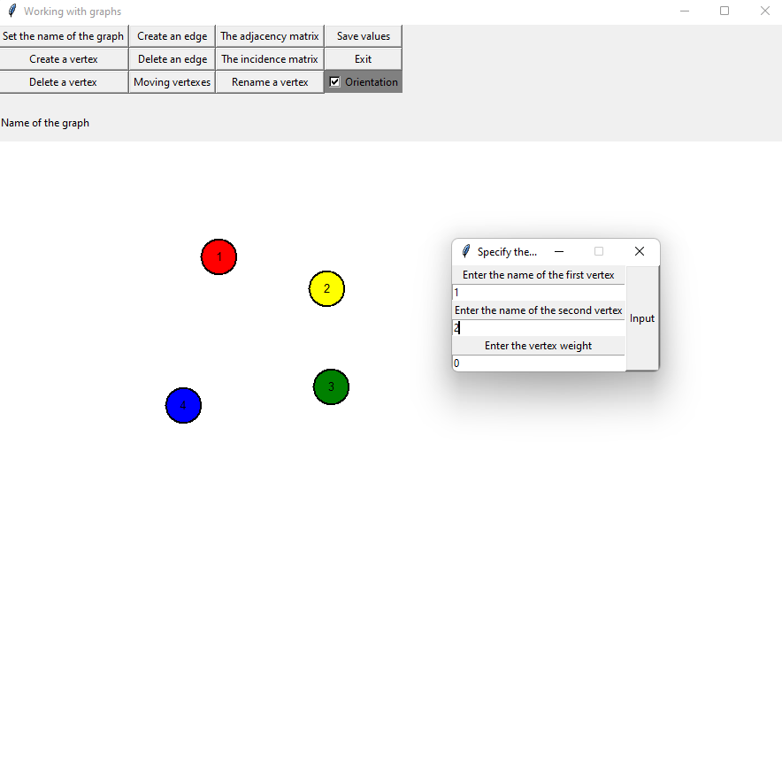
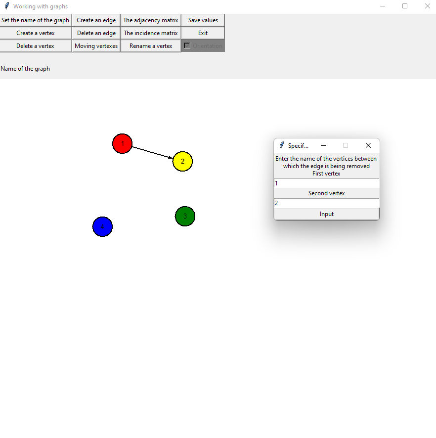
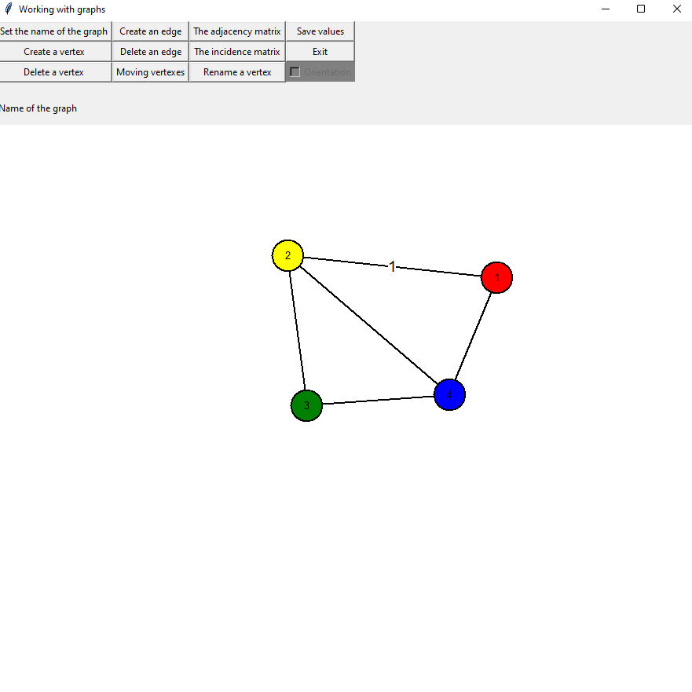
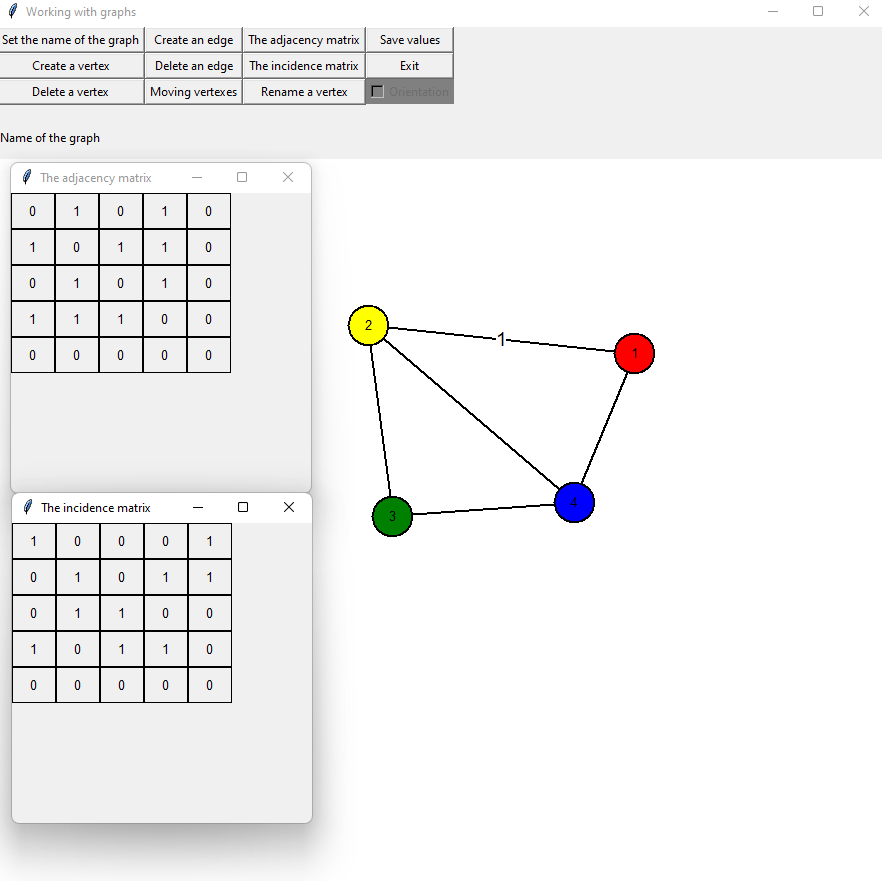

Министерство образования Республики Беларусь <br/>
Учреждение образования <br/>
«Брестский государственный технический университет» <br/>
Кафедра ИИТ <br/>

Лабораторная работа №3 <br/>
За третий семестр <br/>
По дисциплине: «Общая теория интеллектуальных систем» <br/>
Тема: «Разработка программного продукта для работы с графовыми конструкциями» <br/>

Выполнил: <br/>
Студент 2 курса <br/>
Группы ИИ-22 <br/>
Клебанович В.Н. <br/>

Проверил: <br/>
Иванюк Д.С. <br/>

Брест 2022 <br/>

# Общее задание #
1. Разработать и реализовать программный продукт позволяющий
редактировать графовые конструкции различных видов и производить над
ними различные действия. Язык программирования - любой.

2. Редактор должен позволять (задания со **[\*]** являются необязательными):  
  a) одновременно работать с несколькими графами (MDI);  
  b) **[\*]** выделение одновременно нескольких элементов графа, копирование
выделенного фрагмента в clipboard и восстановление из него;  
  c) задавать имена графам;  
  d) сохранять и восстанавливать граф во внутреннем формате программы;  
  e) экспортировать и импортировать граф в текстовый формат (описание
см. ниже);  
  f) создавать, удалять, именовать, переименовывать, перемещать узлы;  
  g) создавать ориентированные и неориентированные дуги, удалять дуги;  
  h) добавлять, удалять и редактировать содержимое узла (содержимое в
виде текста и ссылки на файл);  
  i) задавать цвет дуги и узла, образ узла;  
  j) **[\*]** создавать и отображать петли;  
  k) **[\*]** создавать и отображать кратные дуги.

3. Программный продукт должен позволять выполнять следующие операции:  
  a) выводить информацию о графе:

 + количество вершин, дуг;
 + степени для всех вершин и для выбранной вершины;
 + матрицу инцидентности;
 + матрицу смежности;
 + является ли он деревом, полным, связанным, эйлеровым, **[\*]** планарным;

  b) поиск всех путей (маршрутов) между двумя узлами и кратчайших;  
  c) вычисление расстояния между двумя узлами;  
  d) вычисление диаметра, радиуса, центра графа;  
  e) **[\*]** вычисление векторного и декартово произведения двух графов;  
  f) **[\*]** раскраска графа;  
  g) нахождения эйлеровых, [*] гамильтоновых циклов;  
  h) **[\*]** поиск подграфа в графе, со всеми или некоторыми неизвестными
узлами;  
  i) **[\*]** поиск узла по содержимому;  
  j) **[\*]** объединение, пересечение, сочетание и дополнение графов;  
  k) **[\*]** приведение произвольного графа к определенному типу с
минимальными изменениями:

 + бинарное и обычное дерево;
 + полный граф;
 + планарный граф;
 + связанный граф;

4. Формат текстового представления графа:
<ГРАФ> ::= <ИМЯ ГРАФА> : UNORIENT | ORIENT ; <ОПИСАНИЕ УЗЛОВ> ;
<ОПИСАНИЕ СВЯЗЕЙ> .
<ИМЯ ГРАФА> ::= <ИДЕНТИФИКАТОР>
<ОПИСАНИЕ УЗЛОВ> ::= <ИМЯ УЗЛА> [ , <ИМЯ УЗЛА> …]
<ИМЯ УЗЛА> ::= <ИДЕНТИФИКАТОР>
<ОПИСАНИЕ СВЯЗЕЙ> ::= <ИМЯ УЗЛА> -> <ИМЯ УЗЛА> [ , <ИМЯ УЗЛА> …] ;
[<ОПИСАНИЕ СВЯЗЕЙ> …]

5. Написать отчет по выполненной лабораторной работе в .md формате (readme.md). Разместить его в следующем каталоге: **trunk\ii0xxyy\task_03\doc** (где **xx** - номер группы, **yy** - номер студента, например **ii02102**). 

6. Исходный код разработанной программы разместить в каталоге: **trunk\ii0xxyy\task_03\src**.

## Язык Python ##


``` python
from tkinter import *
from tkinter import messagebox as mb
import numpy as np

app = Tk()  # Creating a window
app.title("Working with graphs")  # Window title
app.geometry("890x860+410+10")  # Window size and location

canvas = Canvas(app, bg="white", width=2000, height=1000)  # Creating a canvas
canvas.place(x=0, y=130)  # Canvas layout

lbl = Label(app)  # Creating a label
lbl.place(x=0, y=100)  # Label location
lbl["text"] = "Name of the graph"  # Label text


# Vertex creation class
class VERTEX:
    def __init__(self, canvas, color):
        global x_press, y_press, vertex_name, vertex_counter
        self.vertex_counter = vertex_counter
        self.vertex_name = vertex_name[-1]
        self.canvas = canvas
        self.color = color
        self.x = x_press
        self.y = y_press
        self.id_vert = canvas.create_oval(self.x - 20, self.y - 20, self.x + 20, self.y + 20, fill=color, width=2)
        self.id_txt = self.canvas.create_text(self.x, self.y,
                                              anchor='center', text=self.vertex_name, font="Arial 10", fill="black")
        canvas.unbind("<Button-1>")

    def get_info(self):
        return self.vertex_counter, self.vertex_name[self.vertex_counter - 1]


# Edge creation class
class EDGE:
    def __init__(self, vertex1: VERTEX, vertex2: VERTEX, weight: int = 0):
        self.vertex1 = vertex1
        self.vertex2 = vertex2
        self.x1, self.y1 = vertex1.x, vertex1.y
        self.x2, self.y2 = vertex2.x, vertex2.y

        self.weight = weight
        if var1.get():
            self.line = canvas.create_line(line_intersect_circle(self.x1, self.y1, self.x2, self.y2),
                                           width=2, arrow="last")
            if weight != "0":
                self.rect = canvas.create_rectangle((self.x1 + self.x2) / 2 - 5,
                                                    (self.y1 + self.y2) / 2 - 8,
                                                    (self.x1 + self.x2) / 2 + 5,
                                                    (self.y1 + self.y2) / 2 + 8,
                                                    fill='white', width=0)
                self.text = canvas.create_text((self.x1 + self.x2) / 2,
                                               (self.y1 + self.y2) / 2,
                                               text=self.weight,
                                               font=('Arial', 14), fill='black', )
            else:
                self.rect = None
                self.text = None
        else:
            self.line = canvas.create_line(line_intersect_circle(self.x1, self.y1, self.x2, self.y2), width=2)
            if weight != "0":
                self.rect = canvas.create_rectangle((self.x1 + self.x2) / 2 - 5,
                                                    (self.y1 + self.y2) / 2 - 8,
                                                    (self.x1 + self.x2) / 2 + 5,
                                                    (self.y1 + self.y2) / 2 + 8,
                                                    fill='white', width=0)
                self.text = canvas.create_text((self.x1 + self.x2) / 2,
                                               (self.y1 + self.y2) / 2,
                                               text=self.weight,
                                               font=('Arial', 14), fill='black', )
            else:
                self.rect = None
                self.text = None

    def delete(self):
        canvas.delete(self.line)
        canvas.delete(self.rect)
        canvas.delete(self.text)


def line_intersect_circle(x1, y1, x2, y2):
    main_hypotenuse = np.sqrt((x2 - x1) ** 2 + (y2 - y1) ** 2)
    main_dx = x2 - x1
    main_dy = y2 - y1
    dx = (main_hypotenuse - 20) * main_dx / main_hypotenuse
    dy = (main_hypotenuse - 20) * main_dy / main_hypotenuse

    return x2 - dx, y2 - dy, x1 + dx, y1 + dy


# Tracking mouse clicks and writing to global variables
def on_wasd(occasion):
    global x_press, y_press
    x_press = occasion.x
    y_press = occasion.y


# Program exit function
def exit_function(root):
    root.destroy()


# Data saving function
def saving_data():
    pass


# Graph name creation function
def name_of_the_graf():
    new_window = Tk()
    new_window.title("Specify the name of the graph")  # Window title
    new_window.wm_attributes('-topmost', 1)  # The window is always on top
    new_window.resizable(False, False)  # Prohibiting window resizing
    lbl_graph = Label(new_window)
    lbl_graph["text"] = "Enter the name of the graph"
    lbl_graph.grid(row=0, column=0, sticky="ew")
    ent = Entry(new_window)
    ent.grid(row=1, column=0)
    btn_graf = Button(new_window, text="Input", command=lambda: change_the_name_of_the_graf(ent.get(), new_window))
    btn_graf.grid(row=2, column=0, sticky="ew")
    if ent.get == lbl["text"]:
        new_window.destroy()
    new_window.mainloop()


# Vertex creation function
def create_a_vertex(root, ent):
    global call_count, vertex_counter, color, vertex, vertex_name
    if '' == ent.get():
        mb.showerror("Error", "You didn't enter the vertex name")
    elif ent.get() in [vert.vertex_name for vert in vertex]:
        mb.showerror("Error", "Such a vertex already exists")
    elif ent.get() not in [vert.vertex_name for vert in vertex]:
        vertex_name[vertex_counter] = ent.get()
        call_count += 1
    if call_count != 0:
        vertex_counter += 1
        vertex.append(VERTEX(canvas, color))
        call_count = 0
        root.destroy()


call_count = 0


# Completed graph name creation function
def change_the_name_of_the_graf(name, root):
    lbl["text"] = name
    exit_function(root)


# Vertex color selection function
def color_selection(number):
    global color
    if number == 1:
        color = "red"
    elif number == 2:
        color = "blue"
    elif number == 3:
        color = "yellow"
    elif number == 4:
        color = "green"
    else:
        color = "white"


# Vertex Creation Menu
def vertex_creation_menu():
    global vertex_name, call_count
    call_count = 0
    canvas.bind("<Button-1>", on_wasd)  # The case of clicking the mouse button
    vertex_name.append("")
    new_window = Tk()
    new_window.geometry("230x100+0+0")
    new_window.wm_attributes('-topmost', 1)
    new_window.resizable(False, False)
    lbl = Label(new_window)
    lbl["text"] = "Enter the vertex name"
    ent = Entry(new_window)
    btn_color1 = Button(new_window, text="Red", command=lambda: color_selection(1), bg="red")
    btn_color2 = Button(new_window, text="Blue", command=lambda: color_selection(2), bg="blue")
    btn_color3 = Button(new_window, text="Yellow", command=lambda: color_selection(3), bg="yellow")
    btn_color4 = Button(new_window, text="Green", command=lambda: color_selection(4), bg="green")
    btn_create = Button(new_window, text="Create\na vertex", command=lambda: create_a_vertex(new_window, ent))
    lbl.grid(row=0, column=0, sticky="ew")
    ent.grid(row=1, column=0, sticky="ewn")
    btn_color1.grid(row=0, column=1, sticky="ew")
    btn_color2.grid(row=1, column=1, sticky="ew")
    btn_color3.grid(row=2, column=1, sticky="ew")
    btn_color4.grid(row=3, column=1, sticky="ewn")
    btn_create.grid(row=3, column=0, sticky="ew")

    new_window.mainloop()


# Vertex movement function
def moving_a_vertex(occasion):
    global x_press, y_press, select_vertex, vertex
    x_press = occasion.x
    y_press = occasion.y
    select_vertex.x = x_press
    select_vertex.y = y_press
    canvas.coords(select_vertex.id_vert, x_press - 20, y_press - 20, x_press + 20, y_press + 20)
    canvas.coords(select_vertex.id_txt, x_press, y_press)
    for edge in edges:
        if edge.vertex1 == select_vertex:
            canvas.coords(edge.line, line_intersect_circle(x_press, y_press, edge.vertex2.x, edge.vertex2.y))
            canvas.coords(edge.rect, (x_press + edge.vertex2.x) / 2 - 5,
                          (y_press + edge.vertex2.y) / 2 - 8,
                          (x_press + edge.vertex2.x) / 2 + 5,
                          (y_press + edge.vertex2.y) / 2 + 8)
            canvas.coords(edge.text, (x_press + edge.vertex2.x) / 2, (y_press + edge.vertex2.y) / 2)

        elif edge.vertex2 == select_vertex:
            canvas.coords(edge.line, line_intersect_circle(edge.vertex1.x, edge.vertex1.y, x_press, y_press))
            canvas.coords(edge.rect, (x_press + edge.vertex1.x) / 2 - 5,
                          (y_press + edge.vertex1.y) / 2 - 8,
                          (x_press + edge.vertex1.x) / 2 + 5,
                          (y_press + edge.vertex1.y) / 2 + 8)
            canvas.coords(edge.text, (x_press + edge.vertex1.x) / 2, (y_press + edge.vertex1.y) / 2)


# Finished vertex moving function
def moving_a_vertex1():
    canvas.bind("<Button-1>", vertex_selection)


# function select vertex with mouse click
def vertex_selection(occasion):
    global x_press, y_press, select_vertex
    x_press = occasion.x
    y_press = occasion.y
    for vert in vertex:
        if vert.x - 20 <= x_press <= vert.x + 20 and vert.y - 20 <= y_press <= vert.y + 20:
            select_vertex = vert
            canvas.bind("<B1-Motion>", moving_a_vertex)
            canvas.bind("<ButtonRelease-1>", canceling_vertex_selection)
            print(select_vertex.vertex_name, x_press, y_press)
            break


# Canceling vertex selection
def canceling_vertex_selection(occasion):
    canvas.unbind("<B1-Motion>")
    canvas.unbind("<ButtonRelease-1>")


# Vertex deleting menu
def finding_a_delete_vertex(ent, root):
    global vertex_name, vertex, vertex_counter, edge_counter
    vertex_counter -= 1
    flag = 1
    while flag:
        for j, edge in enumerate(edges):
            if edge.vertex1.vertex_name == ent or edge.vertex2.vertex_name == ent:
                canvas.delete(edge.line)
                canvas.delete(edge.text)
                canvas.delete(edge.rect)
                edges.pop(j)
                edge_counter -= 1
        for i, vert in enumerate(vertex):
            if vert.vertex_name == ent:
                canvas.delete(vert.id_vert)  # Deleting a vertex by its id
                canvas.delete(vert.id_txt)  # Deleting text by vertex id
                vertex.pop(i)
                vertex_name.pop(i)
                root.destroy()
                flag = 0
                break
        else:
            mb.showerror("Error", "You entered the wrong vertex name")
            break
    if edge_counter == 0:
        c1["state"] = "normal"


# Deleting a vertex
def deleting_a_vertex():
    new_window = Tk()
    new_window.title("Specify the name of the graph")
    new_window.wm_attributes('-topmost', 1)
    new_window.resizable(False, False)
    lbl = Label(new_window)
    lbl["text"] = "Enter the name of the vertex to delete"
    lbl.grid(row=0, column=0, sticky="ew")
    ent = Entry(new_window)
    ent.grid(row=1, column=0)
    btn_delete = Button(new_window, text="Input", command=lambda: finding_a_delete_vertex(ent.get(), new_window))
    btn_delete.grid(row=2, column=0, sticky="ew")
    if ent.get == lbl["text"]:
        new_window.destroy()


# Renaming a vertex
def renaming_a_vertex(en1, en2, root):
    global vertex_name, vertex
    for vert in vertex:
        if vert.vertex_name == en1 and en2 not in vertex_name:
            vert.vertex_name = en1
            canvas.itemconfigure(vert.id_txt, text=en2)
            vertex_name[vertex_name.index(en1)] = en2
            root.destroy()
            break
    else:
        mb.showerror("Error", "You entered the wrong vertex name")


# Vertex renaming menu
def vertex_renaming_menu():
    new_window = Tk()
    new_window.title("Specify the name of the graph")
    new_window.wm_attributes('-topmost', 1)
    new_window.resizable(False, False)
    lbl1 = Label(new_window)
    lbl1["text"] = "Enter the name of the vertex to change"
    lbl1.grid(row=0, column=0, sticky="ew")
    ent1 = Entry(new_window)
    ent1.grid(row=1, column=0, sticky="ew")
    lbl2 = Label(new_window)
    lbl2["text"] = "Enter a new vertex name"
    lbl2.grid(row=2, column=0, sticky="ew")
    ent2 = Entry(new_window)
    ent2.grid(row=3, column=0, sticky="ew")
    btn_rename = Button(new_window, text="Change the name",
                        command=lambda: renaming_a_vertex(ent1.get(), ent2.get(), new_window))
    btn_rename.grid(row=4, column=0, sticky="ew")


# Creating an edge
def creating_an_edge(ent1, ent2, weight, root):
    global vertex, vertex_name, edge_counter
    vert1, vert2 = 0, 0
    for vert in vertex:
        if vert.vertex_name == ent1:
            vert1 = vert
            break
    else:
        mb.showerror("Error", "You entered the wrong vertex name")
    for vert in vertex:
        if vert.vertex_name == ent2:
            vert2 = vert
            break
    else:
        mb.showerror("Error", "You entered the wrong vertex name")
    edges.append(EDGE(vert1, vert2, weight))
    c1["state"] = "disable"
    edge_counter += 1
    root.destroy()


# Edge creation menu
def edge_creation_menu():
    new_window = Tk()
    new_window.title("Specify the name of the graph")
    new_window.wm_attributes('-topmost', 1)
    new_window.resizable(False, False)
    lbl1 = Label(new_window)
    lbl1["text"] = "Enter the name of the first vertex"
    ent1 = Entry(new_window)
    ent2 = Entry(new_window)
    ent3 = Entry(new_window)
    ent3.insert(0, "0")
    lbl2 = Label(new_window)
    lbl3 = Label(new_window)
    lbl3["text"] = "Enter the vertex weight"
    lbl2["text"] = "Enter the name of the second vertex"
    lbl1.grid(row=0, column=0, sticky="ew")
    btn_vertex_name = Button(new_window, text="Input",
                             command=lambda: creating_an_edge(ent1.get(), ent2.get(), ent3.get(), new_window))
    ent1.grid(row=1, column=0, sticky="ew")
    lbl2.grid(row=2, column=0, sticky="ew")
    ent2.grid(row=3, column=0, sticky="ew")
    lbl3.grid(row=4, column=0, sticky="ew")
    ent3.grid(row=5, column=0, sticky="ew")
    btn_vertex_name.grid(row=0, column=1, rowspan=6, sticky="ns")


# Finding the edge to be deleted
def finding_the_edge_to_be_deleted(ent1, ent2, root):
    global vertex, vertex_name, edge_counter, edges
    for i, edge in enumerate(edges):
        if edge.vertex1.vertex_name == ent1 and edge.vertex2.vertex_name == ent2:
            canvas.delete(edge.line)
            canvas.delete(edge.text)
            canvas.delete(edge.rect)
            edges.pop(i)
            edge_counter -= 1
            root.destroy()
            break
    else:
        mb.showerror("Error", "There is no such edge")
    if edge_counter == 0:
        c1["state"] = "normal"


# Edge deleting menu
def edge_deleting_menu():
    new_window = Tk()
    new_window.title("Specify the name of the graph")
    new_window.wm_attributes('-topmost', 1)
    new_window.resizable(False, False)
    lbl = Label(new_window)
    lbl["text"] = "Enter the name of the vertices between \nwhich the edge is being removed\nFirst vertex"
    lbl.grid(row=0, column=0, sticky="ew")
    lbl2 = Label(new_window)
    lbl2["text"] = "Second vertex"
    ent1 = Entry(new_window)
    ent2 = Entry(new_window)
    ent1.grid(row=1, column=0, sticky="ew")
    lbl2.grid(row=2, column=0, sticky="ew")
    ent2.grid(row=3, column=0, sticky="ew")
    btn_delete = Button(new_window, text="Input",
                        command=lambda: finding_the_edge_to_be_deleted(ent1.get(), ent2.get(), new_window))
    btn_delete.grid(row=4, column=0, sticky="ew")


# function create matrix adjacency from list of edges and print it in new window tkinter
def creating_an_adjacency_matrix():
    global vertex_name, edges
    matrix_adjacency = [[0 for i in range(vertex_name.__len__())] for i in range(vertex_name.__len__())]
    for edge in edges:
        matrix_adjacency[vertex_name.index(edge.vertex1.vertex_name)][vertex_name.index(edge.vertex2.vertex_name)] = 1
        matrix_adjacency[vertex_name.index(edge.vertex2.vertex_name)][vertex_name.index(edge.vertex1.vertex_name)] = 1
    window = Tk()
    window.title("The adjacency matrix")
    window.geometry("300x300+0+0")
    for i in range(matrix_adjacency.__len__()):
        for j in range(len(matrix_adjacency[0])):
            Label(window, text=matrix_adjacency[i][j], font="Arial 10", width=5, height=2, borderwidth=1,
                  relief="solid").grid(
                row=i, column=j)
    window.mainloop()


# function create matrix incidence from list of edges and print it in new window tkinter
def creating_an_incidence_matrix():
    global vertex_name, edges
    matrix_incidence = [[0 for i in range(len(edges))] for i in range(len(vertex_name))]
    for i in range(edges.__len__()):
        matrix_incidence[vertex_name.index(edges[i].vertex1.vertex_name)][i] = 1
        matrix_incidence[vertex_name.index(edges[i].vertex2.vertex_name)][i] = 1
    window = Tk()
    window.title("The incidence matrix")
    window.geometry("300x300+0+0")
    for i in range(matrix_incidence.__len__()):
        for j in range(len(matrix_incidence[0])):
            Label(window, text=matrix_incidence[i][j],
                  font="Arial 10", width=5, height=2, borderwidth=1, relief="solid").grid(row=i, column=j)
    window.mainloop()


select_vertex = None
vertex_name = []  # List of vertex names
edges = []
vertex = []  # Global variables
color = "red"  # Vertex color
x_press = 0  # Global variables
x_move = []  # List of x coordinates
y_press = 0  # Global variables
y_move = []  # List of y coordinates
vertex_counter = 0  # Vertex counter
edge_counter = 0
var1 = BooleanVar()
var1.set(False)
var2 = BooleanVar()
var2.set(False)

# Creating the button "Set the name of the graph"
btn1 = Button(app, text="Set the name of the graph", command=name_of_the_graf)
# Creating the button "Create a vertex"
btn2 = Button(app, text="Create a vertex", command=vertex_creation_menu)
# Creating the button "Delete a vertex"
btn3 = Button(app, text="Delete a vertex", command=deleting_a_vertex)
# Creating the button "Create an edge"
btn4 = Button(app, text="Create an edge", command=edge_creation_menu)
# Creating the button "Delete an edge"
btn5 = Button(app, text="Delete an edge", command=edge_deleting_menu)
# Creating the button "Moving vertexes"
btn6 = Button(app, text="Moving vertexes", command=moving_a_vertex1)
# Creating the button "The adjacency vertex"
btn7 = Button(app, text="The adjacency matrix", command=creating_an_adjacency_matrix)
# Creating the button "The incidence matrix"
btn8 = Button(app, text="The incidence matrix", command=creating_an_incidence_matrix)
# Creating the button "Rename a vertex"
btn9 = Button(app, text="Rename a vertex", command=vertex_renaming_menu)
# Creating the button "Save values"
btn10 = Button(app, text="Save values", command=saving_data)
# Creating the button "Exit"
btn11 = Button(app, text="Exit", command=exit)
# Creating the button "Orientation"
c1 = Checkbutton(app, text="Orientation", onvalue=1, offvalue=0, variable=var1, bg="gray")

# Enter data for the location of the vertices
btn1.grid(row=0, column=0, stick="ew")
btn2.grid(row=1, column=0, stick="ew")
btn3.grid(row=2, column=0, stick="ew")
btn4.grid(row=0, column=1, stick="ew")
btn5.grid(row=1, column=1, stick="ew")
btn6.grid(row=2, column=1, stick="ew")
btn7.grid(row=0, column=2, stick="ew")
btn8.grid(row=1, column=2, stick="ew")
btn9.grid(row=2, column=2, stick="ew")
btn10.grid(row=0, column=3, stick="ew")
btn11.grid(row=1, column=3, stick="ew")
c1.grid(row=2, column=3, stick="ew")

app.mainloop()

```

## Создание вершин ##


## Создание ребер ##


## Удаление ребер ##


## Перемещение вершин ##


## Вывод матриц смежности и инцидентности ##

