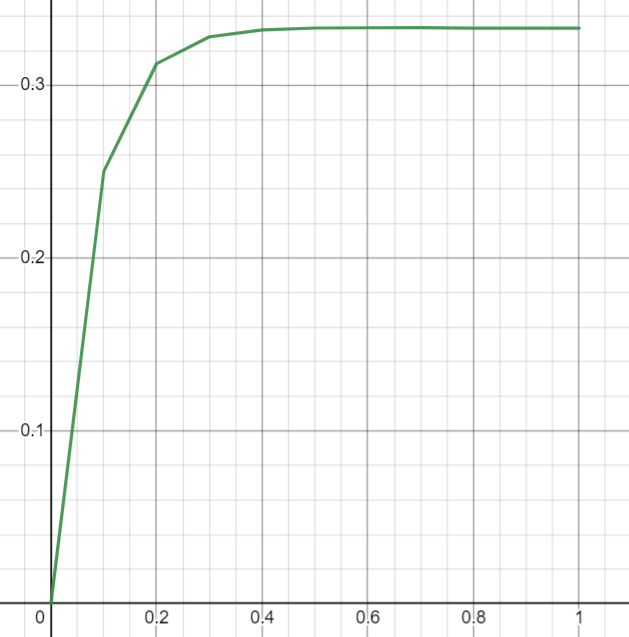

<p align="center"> Министерство образования Республики Беларусь</p>
<p align="center">Учреждение образования</p>
<p align="center">“Брестский Государственный технический университет”</p>
<p align="center">Кафедра ИИТ</p>
<br><br><br><br><br><br><br>
<p align="center">Лабораторная работа №1</p>
<p align="center">По дисциплине “Общая теория интеллектуальных систем”</p>
<p align="center">Тема: “Моделирования температуры объекта”</p>
<br><br><br><br><br>
<p align="right">Выполнил:</p>
<p align="right">Студент 2 курса</p>
<p align="right">Группы ИИ-22</p>
<p align="right">Кузьмич В. Н.</p>
<p align="right">Проверил:</p>
<p align="right">Иванюк Д. С.</p>
<br><br><br><br><br>
<p align="center">Брест 2022</p>


---
# Задание: #
1. Написать отчет по выполненной лабораторной работе №1 в .md формате (readme.md) и с помощью запроса на внесение изменений (**pull request**) разместить его в следующем каталоге: **trunk\ii0xxyy\task_01\doc** (где **xx** - номер группы, **yy** - номер студента, например **ii02102**).
2. Исходный код написанной программы разместить в каталоге: **trunk\ii0xxyy\task_01\src**.

## Task 1. Modeling controlled object ##
Let's get some object to be controlled. We want to control its temperature, which can be described by this differential equation:

$$\Large\frac{dy(\tau)}{d\tau}=\frac{u(\tau)}{C}+\frac{Y_0-y(\tau)}{RC} $$ (1)

where $\tau$ – time; $y(\tau)$ – input temperature; $u(\tau)$ – input warm; $Y_0$ – room temperature; $C,RC$ – some constants.

After transformation we get these linear (2) and nonlinear (3) models:

$$\Large y_{\tau+1}=ay_{\tau}+bu_{\tau}$$ (2)
$$\Large y_{\tau+1}=ay_{\tau}-by_{\tau-1}^2+cu_{\tau}+d\sin(u_{\tau-1})$$ (3)

where $\tau$ – time discrete moments ($1,2,3{\dots}n$); $a,b,c,d$ – some constants.

Task is to write program (**Julia**), which simulates this object temperature.


---
# Код программы #
```julia
a = 0.25; b = 0.25; c = 0.1; d = 0.25; u = 1.0; y = 0.0
println("|-------------------------------|")
println("        Линейная модель")
println("        ===============")
function linear_mod(y, n, t)
    if n < t
        println(y)
        return linear_mod(a * y + b * u, n+1, t)
    end
    println(y)
    return a * y + b * u
end
println(linear_mod(y, 0, 10))
println("|-------------------------------|")
println("         Нелинейная модель")
println("         =================")
function not_linear_mod(y, y_input_temperature, u, u_input_warm, i, t)
    if i == 1
        println(y)
        return not_linear_mod(a*y - b*y_input_temperature^2 + c*1 + d*sin(1), y, u, u, i + 1, t)
    elseif i < t
        println(y)
        return not_linear_mod(a*y - b*y_input_temperature^2 + c*u + d*sin(u_input_warm), y, u, u, i + 1, t)
    end
    println(y)
    return a*y - b*y_input_temperature^2 + c*u + d*sin(u_input_warm)
end
println(not_linear_mod(y, y, u, u, 0, 10))
println("|-------------------------------|")
return 0
```

# Вывод #
```
|-------------------------------|
        Линейная модель
        ===============
0.0
0.25
0.3125
0.328125
0.33203125
0.3330078125
0.333251953125
0.33331298828125
0.3333282470703125
0.3333320617675781
0.33333301544189453
0.33333325386047363
|-------------------------------|
         Нелинейная модель
         =================
0.0
0.31036774620197416
0.38795968275246767
0.38327563241946777
0.36855847544649223
0.36578231246196147
0.3678544868616038
0.3688821928898701
0.36875906354838817
0.36853899403126134
0.36850668297251843
0.3685391694147102
|-------------------------------|
```
---
# Графики #
Линейная модель
<br>

<br>
Нелинейная модель
<br>

