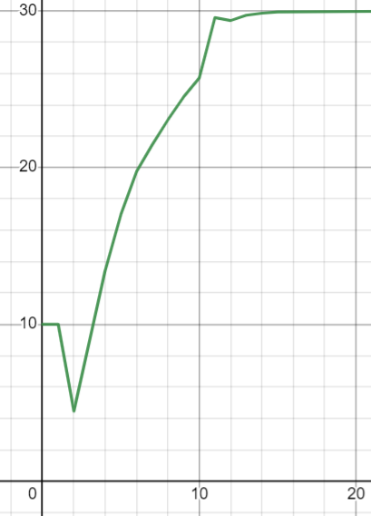

<p align="center"> Министерство образования Республики Беларусь</p>
<p align="center">Учреждение образования</p>
<p align="center">“Брестский Государственный технический университет”</p>
<p align="center">Кафедра ИИТ</p>
<br><br><br><br><br><br><br>
<p align="center">Лабораторная работа №2</p>
<p align="center">По дисциплине “Общая теория интеллектуальных систем”</p>
<p align="center">Тема: “ПИД-регуляторы”</p>
<br><br><br><br><br>
<p align="right">Выполнил:</p>
<p align="right">Студент 2 курса</p>
<p align="right">Группы ИИ-22</p>
<p align="right">Кузьмич В. Н.</p>
<p align="right">Проверил:</p>
<p align="right">Иванюк Д. С.</p>
<br><br><br><br><br>
<p align="center">Брест 2022</p>


---
# Задание: #
На Julia реализовать программу, моделирующую рассмотренный выше ПИД-регулятор. В качестве объекта управления использовать математическую модель, полученную в предыдущей работе. В отчете также привести графики для разных заданий температуры объекта, пояснить полученные результаты.

---
# Код программы #
```julia
a = 0.25; b = 0.25; c = 0.25; d = 0.25 #константы
K = 0.9; T0 = 1; TD = 1.1;T = 1 #константы
q_num_0 =  K * (TD / T0 + 1)  
q_num_1 = -K * (-T0 / T + 1 + 2 * TD / T0)
q_num_2 =  K * (TD / T0)
y_ = 10.0
y = [y_, y_]
u_1 = 1.0
u_p = 1.0
w = 30
e = [w - y_, w - y_]	
println("|---------------------|")
println("         ВЫВОД:")
while abs(y[end] - w) > 0.1
	push!(e, w - y[end])
	global u_1 = u_p + q_num_0 * e[end] + q_num_1 * e[end - 1] + q_num_2 * e[end - 2]
	push!(y, a * y[end] - b * y[end - 1] + c * u_1 + d * sin(u_p))
	global u_p = u_1
end
for i in 1:length(y)
	println(y[i])
end
println("|---------------------|")
return 0
```

# Вывод #
```
|---------------------|
         ВЫВОД:
10.0
10.0
4.960367746201975
10.408787478885802
14.946512208270196
18.100673354845313
20.66970709009182
22.716658588074576
24.841349849645937
25.975783397712853
26.757479700574734
27.15149873104048
28.26211145707371
28.180177319313163
28.70954017600179
29.307965667191812
29.34708441770912
29.35574637555911
29.322275777559312
29.497749901970852
29.724431041938196
29.84425913655503
29.927952561118833
|---------------------|
```
---
# График #
