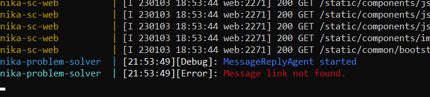

Министерство образования Республики Беларусь  
Учреждение образования  
«Брестский государственный технический университет»  
Кафедра ИИТ  

Лабораторная работа No5  
За третий семестр  
По дисциплине: «Общая теория интеллектуальных систем»  
Тема: «Моделирование управляемого объекта»  

Выполнил:  
Студент 2 курса  
Группы ИИ-22  
Марач М.С.  

Проверил:  
Иванюк Д.С.  

Брест 2022  

# Общее задание #
1.  Изучить следующие открытые проекты:

  1.1.  The [OSTIS](https://github.com/ostis-ai) Technology project;

  1.2.  The OSTIS [Applications](https://github.com/ostis-apps);
2.  Внести свой вклад в проект (в виде оформления вопросов (issues)):
- предложить исправления в ошибках в документации (синтаксические, орфографические и т.п.);
- предложить исправления в исходном коде;
- предложить новую функциональность.

3.  Написать отчет по выполненной работе в .md формате (readme.md) и с помощью pull request разместить его в следующем каталоге: trunk\ii0xxyy\task_04\doc.

# Результат #
  